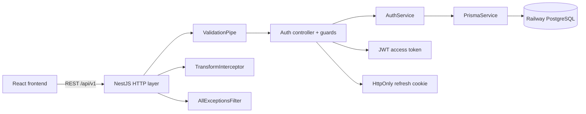
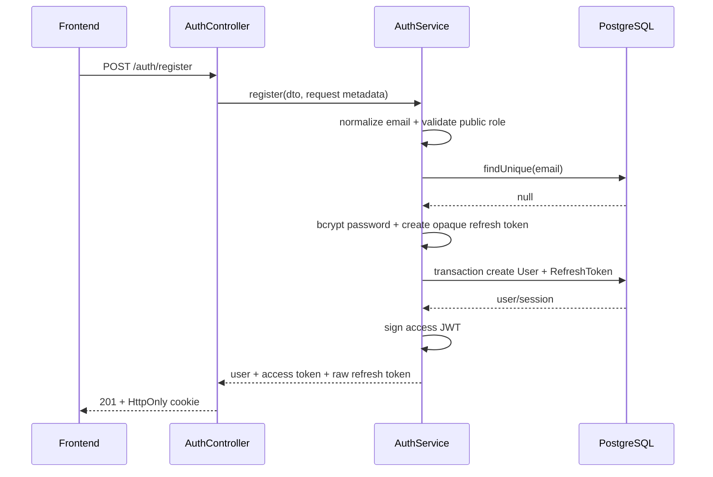
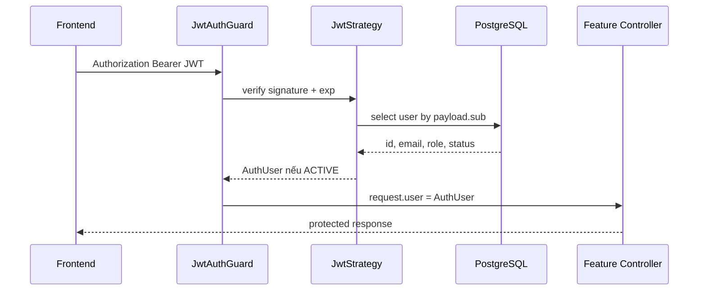

# InternHub — Thiết kế backend tuần 1 cho người A

## 0. Mục đích tài liệu

Tài liệu này là bản thiết kế cần chốt trước khi triển khai code backend tuần 1. Phạm vi được lấy trực tiếp từ `PLAN.md`:

- Người thực hiện: **A**.
- Giai đoạn: **Tuần 1 — Nền tảng**.
- Trách nhiệm backend: setup NestJS, Prisma/migration đầu tiên, Auth, JWT strategy, guard/decorator dùng chung và đăng ký sẵn các module trong `AppModule`.
- Kết quả cuối tuần: frontend có thể đăng ký, đăng nhập, refresh phiên, đăng xuất, lấy thông tin người dùng hiện tại và gọi API được bảo vệ theo role.

Tài liệu không triển khai code và không mở rộng sang feature của các tuần sau.

---

## 1. Phạm vi tuần 1 của người A

### 1.1. Trong phạm vi

1. Chuẩn hóa bootstrap của ứng dụng NestJS.
2. Kết nối Railway PostgreSQL qua Prisma.
3. Xác nhận schema nền và migration đầu tiên chạy được.
4. Hoàn thiện `AuthModule`:
   - đăng ký;
   - đăng nhập;
   - cấp access token;
   - refresh token rotation;
   - đăng xuất;
   - lấy người dùng hiện tại.
5. Hoàn thiện các thành phần dùng chung:
   - `JwtAuthGuard`;
   - `RolesGuard`;
   - `@Roles()`;
   - `@CurrentUser()`;
   - success interceptor;
   - exception filter;
   - validation pipe.
6. Đăng ký skeleton của toàn bộ module vào `AppModule` để hai người phát triển độc lập từ tuần 2.
7. Viết script PowerShell dùng `curl.exe` để kiểm tra tự động toàn bộ endpoint Auth quan trọng.
8. Viết hướng dẫn môi trường, migration và hợp đồng tích hợp cho người B/frontend.

### 1.2. Ngoài phạm vi

- CRUD người dùng dành cho Admin: người B tuần 1.
- Tạo/sửa profile sinh viên, giảng viên, doanh nghiệp: tuần 2.
- Duyệt doanh nghiệp: tuần 2.
- File upload, signed URL: người B.
- Audit log đầy đủ: người B tuần 1; Auth chỉ chừa điểm tích hợp.
- Skills, semesters, placements, supervision, evaluations, dashboard: các tuần sau của người A.
- Redis, Socket.IO, email verification, quên mật khẩu và OAuth.

### 1.3. Nguyên tắc không lấn ownership

- Auth chỉ sở hữu `User` ở mức identity và `RefreshToken` ở mức session.
- Auth không tự tạo `StudentProfile`, `LecturerProfile` hoặc `CompanyProfile` trong tuần 1.
- Dữ liệu hồ sơ không được nhét tạm vào bảng `User`.
- `UsersModule` của người B có thể quản lý trạng thái tài khoản, nhưng không được tự phát hành token hoặc chứa logic đăng nhập.

---

## 2. Trạng thái nền hiện có trong repository

Repository đã có những phần có thể dùng làm baseline:

- NestJS 11 và Prisma 7.
- Schema Prisma đầy đủ cho toàn domain.
- Migration `20260728152817_init`.
- `PrismaModule` global và `PrismaService` dùng PostgreSQL adapter.
- Skeleton của tất cả module nghiệp vụ đã được đăng ký trong `AppModule`.
- DTO đăng ký/đăng nhập, JWT strategy, guard, decorator, interceptor và filter ở mức khung.

Các file hiện tại mới là nền, chưa được xem là Auth hoàn chỉnh vì chưa có `AuthController`, `AuthService`, refresh-token flow, cookie flow và script kiểm tra endpoint tương ứng.

Thiết kế tuần 1 ưu tiên hoàn thiện trên baseline này, không tạo lại project từ đầu và không sửa schema domain nếu không có lỗi blocking.

---

## 3. Mục tiêu kiến trúc



Các quyết định chính:

- Access token là JWT sống ngắn, frontend giữ trong memory và gắn vào header `Authorization`.
- Refresh token là chuỗi ngẫu nhiên opaque, chỉ truyền bằng cookie `HttpOnly`.
- Database chỉ lưu hash của refresh token.
- Mỗi lần refresh phải rotation: token cũ bị revoke, token mới được phát hành.
- JWT strategy luôn kiểm tra lại `User.status === ACTIVE`, không chỉ tin payload.
- RBAC dùng role từ user đã được đọc lại từ database.

---

## 4. Cấu trúc source dự kiến

```text
Backend/src/
├── auth/
│   ├── auth.module.ts
│   ├── auth.controller.ts
│   ├── auth.service.ts
│   ├── dto/
│   │   ├── register.dto.ts
│   │   └── login.dto.ts
│   ├── strategies/
│   │   └── jwt.strategy.ts
│   ├── types/
│   │   ├── auth-user.type.ts
│   │   └── token-payload.type.ts
│   └── utils/
│       ├── refresh-token.util.ts
│       └── cookie-options.util.ts
├── common/
│   ├── decorators/
│   │   ├── current-user.decorator.ts
│   │   └── roles.decorator.ts
│   ├── filters/
│   │   └── http-exception.filter.ts
│   ├── guards/
│   │   ├── jwt-auth.guard.ts
│   │   └── roles.guard.ts
│   └── interceptors/
│       └── transform.interceptor.ts
├── config/
│   └── env.validation.ts
├── prisma/
│   ├── prisma.module.ts
│   └── prisma.service.ts
├── app.module.ts
└── main.ts
```

Không tạo repository abstraction riêng trong tuần 1. `AuthService` có thể dùng `PrismaService` trực tiếp vì Prisma đã là data-access layer có type safety; thêm repository lúc này chỉ tăng lớp trung gian nhưng chưa đem lại lợi ích rõ ràng.

---

## 5. Thiết kế dữ liệu Auth

### 5.1. Bảng `User`

| Field | Ý nghĩa | Quy tắc |
|---|---|---|
| `id` | Identity nội bộ | CUID, không lộ logic tuần tự |
| `email` | Tên đăng nhập | unique, trim và lowercase trước khi lưu/tìm |
| `passwordHash` | Mật khẩu đã hash | bcrypt, tuyệt đối không trả về API |
| `role` | Role hệ thống | `ADMIN`, `STUDENT`, `LECTURER`, `COMPANY` |
| `status` | Trạng thái truy cập | chỉ `ACTIVE` được login/gọi protected API |
| `createdAt`, `updatedAt` | Audit thời gian cơ bản | do Prisma quản lý |

### 5.2. Bảng `RefreshToken`

| Field | Ý nghĩa | Quy tắc |
|---|---|---|
| `id` | Session id nội bộ | CUID |
| `userId` | Chủ phiên | xóa cascade khi xóa user |
| `tokenHash` | SHA-256 của token gốc | unique; token gốc không lưu DB |
| `expiresAt` | Hạn phiên | mặc định 7 ngày |
| `revokedAt` | Thời điểm thu hồi | null khi còn hiệu lực |
| `userAgent` | Thông tin thiết bị | optional, cắt độ dài trước khi lưu |
| `ipAddress` | IP tạo phiên | optional; xử lý proxy đúng khi deploy |
| `createdAt` | Thời điểm tạo | dùng cho quản lý session về sau |

Schema hiện tại đã đủ cho phạm vi tuần 1. Không cần migration mới nếu migration nền đã khớp Railway.

### 5.3. Invariant bắt buộc

- Email khác hoa/thường phải được xem là cùng một tài khoản ở tầng service.
- Không lưu plaintext password hoặc plaintext refresh token.
- Token hết hạn hoặc đã revoke không thể refresh.
- User `INACTIVE`/`BANNED` không thể đăng nhập, refresh hoặc dùng access token cũ.
- Logout là idempotent: cookie luôn được xóa dù token không còn tồn tại.

---

## 6. Chính sách đăng ký tài khoản

### 6.1. Public registration

Tuần 1 chỉ cho phép tự đăng ký hai role:

- `STUDENT`;
- `COMPANY`.

Không cho client public gửi `ADMIN` hoặc `LECTURER`. Hai role này phải được seed hoặc được Admin tạo qua `UsersModule` của người B.

Lý do: nếu API public nhận mọi enum role, người dùng có thể tự nâng quyền thành Admin.

### 6.2. Dữ liệu đăng ký tuần 1

Request chỉ gồm:

```json
{
  "email": "student@example.com",
  "password": "StrongPass123!",
  "role": "STUDENT"
}
```

`fullName` không thuộc bảng `User`, vì vậy không nhận hoặc không silently discard trường này. Tên và các thông tin hồ sơ sẽ được tạo qua profile module tuần 2.

### 6.3. Password policy

- Tối thiểu 8 ký tự.
- Tối đa 72 bytes do giới hạn thực tế của bcrypt.
- Yêu cầu ít nhất một chữ và một số.
- Không yêu cầu pattern quá phức tạp trong MVP để tránh UX tệ.
- Bcrypt cost mặc định: 12, có thể cấu hình qua environment cho test.

---

## 7. Thiết kế token và session

### 7.1. Access token

- Loại: JWT ký bằng HMAC secret.
- TTL mặc định: 15 phút.
- Payload tối thiểu:

```json
{
  "sub": "user-id",
  "email": "student@example.com",
  "role": "STUDENT"
}
```

- Không đưa password, status, profile hoặc dữ liệu nhạy cảm vào JWT.
- `iat` và `exp` do JWT library thêm.
- Frontend gắn token vào `Authorization: Bearer <accessToken>`.

### 7.2. Refresh token

- Loại: opaque random token 32 bytes trở lên, encode base64url hoặc hex.
- TTL mặc định: 7 ngày.
- Gửi bằng cookie tên `refresh_token`.
- Cookie options ở local:
  - `httpOnly: true`;
  - `secure: false`;
  - `sameSite: 'lax'`;
  - `path: '/api/v1/auth'`;
  - `maxAge: 7 ngày`.
- Production phải bật `secure: true`; nếu frontend/API khác site thì cấu hình `sameSite: 'none'` và CORS credentials tương ứng.

### 7.3. Rotation

Khi gọi refresh:

1. Đọc refresh token từ cookie.
2. Hash token bằng SHA-256.
3. Tìm record theo `tokenHash`.
4. Từ chối nếu không tồn tại, đã revoke hoặc hết hạn.
5. Đọc user và xác nhận `ACTIVE`.
6. Trong transaction:
   - đặt `revokedAt` cho token cũ;
   - tạo refresh token mới;
   - trả access token mới.
7. Ghi refresh token mới vào cookie.

Rotation giúp giảm thiệt hại nếu token cũ bị lộ. Hai request refresh đồng thời chỉ một request được thành công; update token cũ nên kèm điều kiện `revokedAt: null` để tránh race condition.

### 7.4. Logout

- Logout dựa trên refresh cookie, không phụ thuộc access token còn hạn.
- Nếu tìm thấy session thì set `revokedAt`.
- Luôn clear cookie.
- Không xóa record để giữ dấu vết phiên và hỗ trợ điều tra lỗi.

---

## 8. Hợp đồng API tuần 1

Base URL: `/api/v1`.

Success response chung:

```json
{
  "success": true,
  "data": {},
  "timestamp": "2026-07-31T00:00:00.000Z"
}
```

Error response chung:

```json
{
  "success": false,
  "statusCode": 400,
  "code": "VALIDATION_ERROR",
  "message": ["password must be longer than or equal to 8 characters"],
  "timestamp": "2026-07-31T00:00:00.000Z",
  "path": "/api/v1/auth/register"
}
```

### 8.1. `POST /auth/register`

Public, rate limit chặt hơn API thường.

Request:

```json
{
  "email": "student@example.com",
  "password": "StrongPass123!",
  "role": "STUDENT"
}
```

Response `201`:

```json
{
  "user": {
    "id": "cm...",
    "email": "student@example.com",
    "role": "STUDENT",
    "status": "ACTIVE"
  },
  "accessToken": "ey...",
  "expiresIn": 900
}
```

Kèm header `Set-Cookie` cho refresh token.

Lỗi:

- `400 VALIDATION_ERROR` — body không hợp lệ hoặc role không được public register.
- `409 EMAIL_ALREADY_EXISTS` — email đã được dùng.
- `429 TOO_MANY_REQUESTS` — vượt rate limit.

### 8.2. `POST /auth/login`

Public, rate limit chặt.

Request:

```json
{
  "email": "student@example.com",
  "password": "StrongPass123!"
}
```

Response `200`: giống phần data của register và set refresh cookie mới.

Lỗi:

- `401 INVALID_CREDENTIALS` — email hoặc password sai; không tiết lộ trường nào sai.
- `403 ACCOUNT_NOT_ACTIVE` — tài khoản tồn tại nhưng không active.
- `429 TOO_MANY_REQUESTS`.

### 8.3. `POST /auth/refresh`

Public về access-token guard nhưng yêu cầu refresh cookie hợp lệ.

Request body: rỗng.

Response `200`:

```json
{
  "accessToken": "ey...",
  "expiresIn": 900
}
```

Kèm refresh cookie đã rotate.

Lỗi:

- `401 REFRESH_TOKEN_MISSING`.
- `401 REFRESH_TOKEN_INVALID`.
- `401 REFRESH_TOKEN_EXPIRED`.
- `403 ACCOUNT_NOT_ACTIVE`.

### 8.4. `POST /auth/logout`

Không yêu cầu access token. Dùng refresh cookie hiện tại nếu có.

Response `200`:

```json
{
  "loggedOut": true
}
```

Cookie bị clear trong mọi trường hợp.

### 8.5. `GET /auth/me`

Yêu cầu `JwtAuthGuard`.

Response `200`:

```json
{
  "id": "cm...",
  "email": "student@example.com",
  "role": "STUDENT",
  "status": "ACTIVE"
}
```

Không trả `passwordHash`, refresh token hoặc toàn bộ relation/profile.

Lỗi:

- `401 ACCESS_TOKEN_MISSING`.
- `401 ACCESS_TOKEN_INVALID`.
- `401 ACCESS_TOKEN_EXPIRED`.
- `401 ACCOUNT_NOT_AVAILABLE` nếu user đã bị xóa/bị khóa sau khi token được cấp.

---

## 9. Luồng xử lý chi tiết

### 9.1. Register



### 9.2. Login

1. Normalize email.
2. Tìm user theo email, chỉ select các field cần thiết gồm `passwordHash`.
3. So sánh bcrypt.
4. Nếu email không tồn tại vẫn nên thực hiện một lần bcrypt với dummy hash để giảm chênh lệch timing rõ ràng.
5. Kiểm tra status.
6. Tạo refresh session.
7. Ký access JWT.
8. Trả user public + access token; controller set cookie.

### 9.3. Protected request



---

## 10. Guard, decorator và RBAC

### 10.1. `JwtAuthGuard`

- Xác thực Bearer token qua Passport JWT.
- Chuẩn hóa lỗi thiếu/sai/hết hạn token thành `401`.
- Không chứa logic role.

### 10.2. `RolesGuard`

- Đọc metadata từ `@Roles(...)` ở method và controller.
- Nếu không có metadata role thì cho qua.
- Nếu có role nhưng request chưa có user thì trả `401` hoặc yêu cầu luôn đặt sau `JwtAuthGuard`.
- Nếu user không đúng role thì trả `403 FORBIDDEN_ROLE`.

Pattern sử dụng thống nhất:

```ts
@UseGuards(JwtAuthGuard, RolesGuard)
@Roles(Role.ADMIN)
```

Tuần 1 không đặt JWT guard global để tránh phải xây thêm `@Public()` và giảm rủi ro vô tình khóa endpoint public. Khi dự án lớn hơn có thể đổi quyết định này theo một PR riêng.

### 10.3. `@CurrentUser()`

Kiểu dữ liệu chung:

```ts
type AuthUser = {
  id: string;
  email: string;
  role: Role;
};
```

Nên dùng `id`, không dùng đồng thời cả `id` và `sub` trong code nghiệp vụ. `sub` chỉ là tên claim bên trong JWT; strategy chuyển nó thành `AuthUser.id` trước khi gắn vào request.

Decorator hỗ trợ:

- `@CurrentUser()` — lấy cả object;
- `@CurrentUser('id')` — lấy user id;
- `@CurrentUser('role')` — lấy role.

Đây là contract mà tất cả module của A và B sẽ import.

---

## 11. Bootstrap và cross-cutting concern

### 11.1. `main.ts`

Thứ tự setup đề xuất:

1. Tạo Nest app.
2. Lấy `ConfigService`.
3. Bật `helmet`.
4. Bật CORS với allowlist frontend và `credentials: true`.
5. Set global prefix `api`.
6. Bật URI versioning mặc định `v1`.
7. Đăng ký global `ValidationPipe`.
8. Đăng ký global `TransformInterceptor`.
9. Đăng ký global `AllExceptionsFilter`.
10. Bật graceful shutdown hooks.
11. Listen port.

`ValidationPipe`:

- `whitelist: true`;
- `forbidNonWhitelisted: true`;
- `transform: true`;
- không tự convert các giá trị nguy hiểm nếu DTO chưa khai báo type rõ ràng.

### 11.2. Error handling

Exception filter phải:

- giữ đúng HTTP status;
- luôn trả `success: false`;
- trả `code` ổn định để frontend xử lý;
- không trả stack trace cho client;
- log stack trace ở server cho lỗi 5xx;
- không log password, raw token hoặc cookie.

### 11.3. Rate limit

- Mặc định toàn API: 60 request/phút/IP.
- Login và register: khoảng 5 request/phút/IP cho MVP.
- Refresh: khoảng 10 request/phút/IP.
- Không dùng Redis tuần 1; chấp nhận in-memory throttling vì backend mới chạy một instance local.

### 11.4. Configuration validation

Ứng dụng phải fail fast nếu thiếu biến bắt buộc:

```dotenv
DATABASE_URL=
JWT_SECRET=
JWT_EXPIRES_IN_SECONDS=900
JWT_REFRESH_EXPIRES_IN_SECONDS=604800
BCRYPT_ROUNDS=12
PORT=3000
NODE_ENV=development
FRONTEND_URL=http://localhost:5173
COOKIE_SAME_SITE=lax
```

Không commit `.env`. `.env.example` chỉ chứa placeholder.

---

## 12. Prisma và migration

### 12.1. Quy trình tuần 1

1. Xác nhận `Backend/prisma/schema.prisma` format và validate được.
2. Xác nhận migration nền tương ứng với schema.
3. Trên Railway dùng:

```bash
npm exec prisma migrate deploy
```

4. Generate client:

```bash
npm exec prisma generate
```

5. Chạy build và health check.

Không dùng `prisma db push` cho database chung của nhóm vì nó bỏ qua lịch sử migration.

### 12.2. Quy tắc khi hai người cùng làm

- Chỉ tạo migration khi schema thực sự thay đổi.
- Tên migration mô tả thay đổi, không dùng lại `init`.
- Commit cả `schema.prisma` và thư mục migration mới.
- Không commit `src/generated/prisma`.
- Trước khi merge migration, người còn lại chạy `prisma migrate deploy` trên DB test/local và `npm run build`.

### 12.3. Seed tối thiểu cho phát triển

Seed nên tạo một tài khoản `ADMIN` và một `LECTURER` từ environment hoặc password dev rõ ràng, không hard-code credential production. Public registration không được dùng để tạo hai role này.

Seed không phải migration và phải an toàn khi chạy lại bằng upsert theo email.

---

## 13. Bảo mật và rủi ro

| Rủi ro | Biện pháp tuần 1 |
|---|---|
| Client tự đăng ký ADMIN | whitelist role public chỉ STUDENT/COMPANY |
| Lộ mật khẩu | bcrypt; không log request body Auth |
| Lộ refresh token trong DB | chỉ lưu SHA-256 hash |
| XSS lấy refresh token | cookie HttpOnly |
| Refresh token bị replay | rotation và revoke atomically |
| JWT cũ vẫn dùng sau khi khóa user | strategy đọc lại status từ DB mỗi request |
| Brute force login | generic error + throttling |
| Mass assignment | DTO + whitelist + forbidNonWhitelisted |
| CORS quá rộng | allowlist theo `FRONTEND_URL`, bật credentials có kiểm soát |
| Secret bị commit | `.env` ignored, `.env.example` chỉ placeholder |
| Response làm lộ password hash | dùng explicit select/public mapper |
| Race khi register cùng email | bắt Prisma unique violation và trả 409 |
| Race khi refresh | conditional revoke/update trong transaction |

CSRF ở refresh/logout được giảm bằng `SameSite=Lax` trong môi trường hiện tại. Khi chuyển sang frontend/API cross-site và dùng `SameSite=None`, phải bổ sung CSRF token hoặc kiểm tra Origin nghiêm ngặt trước khi production.

---

## 14. Kế hoạch kiểm tra bằng endpoint và `curl`

Tuần 1 không bắt buộc viết unit test hoặc Jest E2E test. Cách kiểm tra chính là chạy ứng dụng thật, gọi endpoint bằng `curl.exe` và xác nhận đồng thời controller, validation, guard, JWT, cookie, Prisma và PostgreSQL.

Không nên chỉ copy từng lệnh thủ công. Cần tạo một script có thể chạy lại, dự kiến:

```text
Backend/scripts/test-auth.ps1
```

Script phải tự dừng và báo lỗi khi HTTP status hoặc response body không đúng dự kiến. Kết quả cuối cùng phải trả exit code `0` khi tất cả trường hợp pass và khác `0` khi có trường hợp thất bại.

### 14.1. Nguyên tắc chạy

1. Chạy backend ở `http://localhost:3000`.
2. Script dùng base URL `http://localhost:3000/api/v1` hoặc nhận base URL qua parameter.
3. Dùng `curl.exe`, không dùng alias `curl` của PowerShell để tránh khác hành vi giữa các máy.
4. Dùng file cookie tạm với `-c` và `-b` để lưu/gửi refresh cookie.
5. Lấy access token từ JSON response và gắn vào Bearer header khi gọi `/auth/me`.
6. Dùng `-o` và `-w "%{http_code}"` để tách body và HTTP status cho assertion.
7. Xóa file cookie/body tạm sau khi script kết thúc.
8. Không in access token, refresh cookie hoặc password ra log CI/terminal nếu không cần thiết.

Ví dụ register:

```powershell
$baseUrl = "http://localhost:3000/api/v1"
$cookieFile = Join-Path $env:TEMP "internhub-auth-cookies.txt"

curl.exe -sS `
  -c $cookieFile `
  -H "Content-Type: application/json" `
  -d '{"email":"student@example.com","password":"StrongPass123!","role":"STUDENT"}' `
  "$baseUrl/auth/register"
```

Ví dụ refresh bằng cookie đã lưu:

```powershell
curl.exe -sS `
  -b $cookieFile `
  -c $cookieFile `
  -X POST `
  "$baseUrl/auth/refresh"
```

### 14.2. Các trường hợp bắt buộc trong script

1. `POST /auth/register` với `STUDENT` trả `201`.
2. Response register có user public, access token và header refresh cookie.
3. Register trùng email khác chữ hoa/thường trả `409`.
4. Register public với `ADMIN` hoặc `LECTURER` trả `400`.
5. `POST /auth/login` đúng password trả `200` và session mới.
6. Login sai password trả `401` và không tiết lộ email hay password sai.
7. `GET /auth/me` không có Bearer token trả `401`.
8. `/auth/me` với access token hợp lệ trả đúng `id`, `email`, `role`, `status`.
9. Response không chứa `passwordHash`, `tokenHash` hoặc raw refresh token.
10. `POST /auth/refresh` với cookie hợp lệ trả `200`, access token mới và cookie mới.
11. Refresh lại bằng cookie/token cũ trả `401` để chứng minh rotation hoạt động.
12. `POST /auth/logout` trả `200`, clear cookie và revoke session.
13. Refresh sau logout trả `401`.
14. User `BANNED` không login được.
15. Access token đã cấp cho user vừa bị `BANNED` không gọi `/auth/me` được.
16. Gửi field không thuộc DTO trả `400` do `forbidNonWhitelisted`.
17. Gọi login/register quá rate limit trả `429`.

### 14.3. Kiểm tra role guard bằng endpoint mẫu

Để xác nhận `RolesGuard`, có thể tạo một endpoint kiểm tra tạm trong môi trường development hoặc dùng endpoint Admin đầu tiên của người B khi đã có:

```text
GET /api/v1/users
```

Kỳ vọng:

- Không có access token: `401`.
- Token STUDENT: `403`.
- Token ADMIN: `200`.

Không giữ endpoint debug không cần thiết trong production.

### 14.4. Database dùng để kiểm tra

Script curl phải chạy trên database local/test riêng hoặc một Railway database dành riêng cho development. Không thực hiện cleanup destructive trên Railway database dùng chung của nhóm.

Email kiểm tra nên được tạo duy nhất theo timestamp để script chạy lại không xung đột, ví dụ:

```text
student.20260731230000@example.com
```

Các trường hợp cần đổi trạng thái user sang `BANNED` có thể dùng Prisma Studio hoặc câu lệnh hỗ trợ development có target rõ ràng. Không thêm public endpoint chỉ để sửa trạng thái test.

### 14.5. Điều kiện pass

Backend tuần 1 được xem là đạt về kiểm tra khi:

- `npm run build` pass;
- script `scripts/test-auth.ps1` chạy hết và trả exit code `0`;
- toàn bộ HTTP status quan trọng được assert;
- register → me → refresh → logout chạy trên API và database thật;
- không cần đạt Jest coverage trong tuần 1.

---

## 15. Contract bàn giao cho người B

Sau tuần 1, người B được quyền coi các interface sau là ổn định:

- `PrismaService` được cung cấp global.
- `JwtAuthGuard` xác thực user active.
- `RolesGuard` kết hợp với `@Roles()`.
- `@CurrentUser('id')` trả `User.id`.
- Protected API nhận Bearer access token.
- Frontend phải gửi `withCredentials: true` cho login/register/refresh/logout để nhận/gửi refresh cookie.
- Success response có `{ success, data, timestamp }`.
- Error response có `statusCode`, `code`, `message`, `timestamp`, `path`.

Ranh giới với `UsersModule`:

- B quản lý danh sách user, status và thao tác Admin.
- B không đọc hoặc trả `passwordHash`/refresh token.
- Khi B khóa user, access token đang tồn tại sẽ bị `JwtStrategy` từ chối ở request tiếp theo.
- Nếu B cần tạo Lecturer/Admin, B gọi logic tạo user nội bộ hoặc dùng service chung được Auth export; không gọi public register endpoint.

Ranh giới với audit log:

- Tuần 1 Auth không phụ thuộc cứng vào `AuditLogsModule` để tránh chặn tiến độ.
- Khi audit service sẵn sàng, các event nên ghi gồm `AUTH_LOGIN_SUCCESS`, `AUTH_LOGIN_FAILED`, `AUTH_REFRESH`, `AUTH_LOGOUT` và `AUTH_REGISTER`.
- Metadata audit không chứa password hoặc raw token.

---

## 16. Kế hoạch thực hiện trong 5 ngày

### Ngày 1 — Baseline và database

- Validate environment.
- Kiểm tra Prisma schema/migration.
- Kết nối Railway PostgreSQL.
- Chạy `migrate deploy`, `generate`, `build`.
- Chốt DTO/API contract với frontend và người B.

Đầu ra: app khởi động ổn định, database kết nối được, migration có thể tái lập.

### Ngày 2 — Register và login

- `AuthController`, `AuthService`.
- Normalize email, password policy, bcrypt.
- Public role policy.
- Access token và refresh-session creation.
- Dùng `curl.exe` kiểm tra register, duplicate email, role không hợp lệ, login đúng và login sai.

Đầu ra: register/login chạy được bằng API client.

### Ngày 3 — Refresh, logout, me

- Opaque refresh token và cookie options.
- Rotation transaction.
- Logout idempotent.
- `/auth/me`.
- Dùng cookie jar của `curl.exe` kiểm tra refresh rotation, logout và refresh sau logout.

Đầu ra: vòng đời phiên hoàn chỉnh.

### Ngày 4 — Guard, response và security

- Hoàn thiện JWT strategy, guards, decorators.
- Global interceptor/filter/validation.
- Rate limit Auth.
- Chuẩn hóa error code.
- Viết `scripts/test-auth.ps1` để tự động chạy toàn bộ Auth flow qua endpoint.

Đầu ra: các module khác có thể bảo vệ endpoint theo role.

### Ngày 5 — Integration và bàn giao

- Kiểm tra cùng frontend Axios interceptor.
- Kiểm tra role-based redirect bằng dữ liệu seed.
- Chạy `npm run build` và script curl `scripts/test-auth.ps1`.
- Cập nhật README/env example.
- Bàn giao contract cho người B.

Đầu ra: đạt Definition of Done tuần 1.

---

## 17. Thứ tự triển khai code đề xuất

1. Chốt environment names và cookie policy.
2. Chốt `AuthUser`/JWT payload types.
3. Sửa DTO theo public registration policy.
4. Viết refresh-token utility và public user mapper.
5. Viết `AuthService`.
6. Viết `AuthController`.
7. Hoàn thiện JWT strategy.
8. Hoàn thiện guards/decorators.
9. Đăng ký global filter/interceptor và validation.
10. Viết script PowerShell gọi endpoint bằng `curl.exe` và assert HTTP status/body.
11. Chạy toàn bộ trường hợp register, login, me, refresh rotation, logout, RBAC và rate limit.
12. Kiểm tra frontend integration.
13. Chỉ sau khi tất cả pass mới bắt đầu feature tuần 2.

---

## 18. Definition of Done tuần 1 cho người A

- [ ] Railway PostgreSQL kết nối được từ backend local.
- [ ] Migration nền chạy được bằng `prisma migrate deploy`.
- [ ] `npm run build` pass.
- [ ] Register chỉ cho STUDENT/COMPANY.
- [ ] Login trả access token và set refresh cookie.
- [ ] Refresh rotation hoạt động và token cũ không dùng lại được.
- [ ] Logout revoke phiên và clear cookie.
- [ ] `/auth/me` trả đúng user active.
- [ ] `JwtAuthGuard`, `RolesGuard`, `@Roles`, `@CurrentUser` dùng được từ module khác.
- [ ] User bị khóa không dùng access/refresh token được.
- [ ] Response success/error có format thống nhất.
- [ ] Auth endpoints có rate limit.
- [ ] `scripts/test-auth.ps1` dùng `curl.exe` và tự assert HTTP status/body.
- [ ] Script curl register → me → refresh → logout pass và trả exit code `0`.
- [ ] Script curl xác nhận role sai trả `403` và token thiếu/sai trả `401`.
- [ ] Không trả/log password hash hoặc raw refresh token.
- [ ] README và `.env.example` đủ để người B chạy project.
- [ ] Frontend đăng nhập/logout và interceptor gọi protected API được.

---

## 19. Tiêu chí không chấp nhận

Không coi tuần 1 hoàn thành nếu còn một trong các tình trạng sau:

- Refresh token lưu plaintext hoặc trả trong JSON body.
- Public register tạo được ADMIN/LECTURER.
- Login chỉ kiểm tra JWT mà không kiểm tra user status.
- Logout chỉ xóa cookie nhưng không revoke record trong DB.
- Controller trả trực tiếp Prisma user có `passwordHash`.
- Dùng `prisma db push` trên Railway DB chung thay cho migration.
- Guard/decorator chưa có contract ổn định khiến người B phải tự viết bản khác.
- Script curl chỉ kiểm tra happy path, chưa kiểm tra duplicate email, banned user và refresh token cũ.

---

## 20. Kết luận thiết kế

Backend tuần 1 của người A là lớp nền identity + security cho toàn InternHub. Trọng tâm không phải tạo nhiều endpoint mà là tạo một vòng đời session đúng, an toàn và có contract ổn định để toàn bộ feature tuần 2–7 dùng chung.

Sau khi chốt tài liệu này, phần code nên bám đúng thứ tự ở mục 17 và chỉ thay đổi thiết kế khi phát hiện constraint thực tế từ frontend, Railway hoặc schema.
