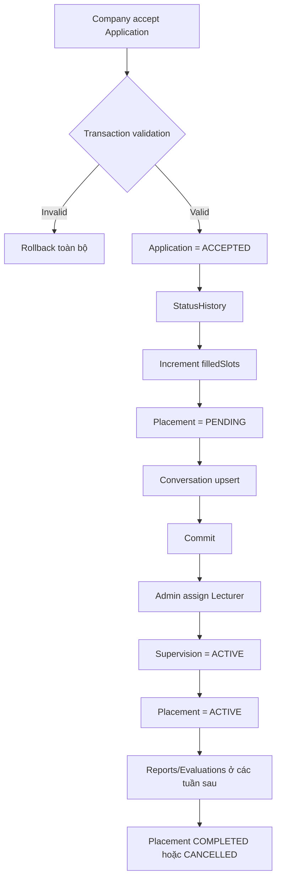

# CareerBridge — Kế hoạch triển khai Tuần 4 cho Người A

## 1. Phạm vi và mục tiêu

**Người thực hiện:** A  
**Tuần:** 4 — Ứng tuyển và phân công  
**Feature chính:** Internship Placement + Lecturer Supervision  
**Mức độ:** Light về số màn hình, nhưng có transaction và phân quyền quan trọng

Theo `PLAN.md`, Tuần 4 được chia như sau:

- Người A sở hữu lifecycle của `InternshipPlacement` sau khi application được chấp nhận.
- Người A sở hữu toàn bộ CRUD/lifecycle của `Supervision` và giao diện Admin phân công giảng viên.
- Người B sở hữu Application state machine, review accept/reject, status history, CV review và conversation.
- Điểm tích hợp bắt buộc là transaction `Application ACCEPTED → Placement PENDING`.

Mục tiêu cuối tuần:

- Application được accept chỉ tạo đúng một placement và không thể tạo trùng.
- Placement được tạo ở `PENDING`, lưu đúng student/company/internship/semester.
- Admin phân công hoặc đổi giảng viên cho một placement.
- Khi phân công thành công, placement chuyển sang `ACTIVE` trong cùng transaction.
- Student xem được vị trí thực tập và giảng viên hướng dẫn thật.
- Lecturer xem được danh sách placement mình đang phụ trách.
- Admin lọc được placement đã/chưa phân công và xem workload giảng viên.
- Mọi mutation quan trọng có audit log.
- Backend/frontend build thành công và các endpoint được kiểm thử bằng `curl`.

## 2. Hiện trạng hệ thống cần tôn trọng

### 2.1. Phần đã có

- Auth JWT, refresh cookie, `JwtAuthGuard`, `RolesGuard`, `@Roles()` và `@CurrentUser()` đã hoạt động.
- API dùng prefix `/api/v1`.
- Response thành công có dạng `{ success: true, data, timestamp }`.
- Error có dạng `{ success: false, statusCode, code, message, timestamp, path }`.
- Global validation đã bật `whitelist`, `forbidNonWhitelisted` và `transform`.
- Role backend là `ADMIN`, `STUDENT`, `LECTURER`, `COMPANY`.
- Prisma schema đã có `Application`, `ApplicationStatusHistory`, `InternshipPlacement`, `Supervision`, `Report`, `Evaluation` và các enum cần thiết.
- `Semester`, `Profiles`, `Skills`, Auth và seed tài khoản đã có dữ liệu thật.
- `placements`, `supervisions`, `applications`, `internships` hiện vẫn là module skeleton ở thời điểm lập plan.
- Frontend `TeacherAssignment` hiện dùng mock `StudentProfile.assignedTeacherId`; phải thay bằng placement/supervision API thật, không tiếp tục duy trì song song hai nguồn dữ liệu.
- `LecturersController` hiện chỉ có `/lecturers/me`; Admin chưa có API lấy danh sách lecturer options.

### 2.2. Schema hiện tại

```prisma
enum PlacementStatus {
  PENDING
  ACTIVE
  COMPLETED
  CANCELLED
}

enum SupervisionStatus {
  ACTIVE
  COMPLETED
  CANCELLED
}

model InternshipPlacement {
  id            String          @id @default(cuid())
  applicationId String          @unique
  studentId     String
  companyId     String
  internshipId  String
  semesterId    String
  status        PlacementStatus @default(PENDING)
  startDate     DateTime?
  endDate       DateTime?
  createdAt     DateTime        @default(now())
  updatedAt     DateTime        @updatedAt

  application Application    @relation(fields: [applicationId], references: [id], onDelete: Restrict)
  student     StudentProfile @relation(fields: [studentId], references: [id], onDelete: Restrict)
  company     CompanyProfile @relation(fields: [companyId], references: [id], onDelete: Restrict)
  internship  Internship     @relation(fields: [internshipId], references: [id], onDelete: Restrict)
  semester    Semester       @relation(fields: [semesterId], references: [id], onDelete: Restrict)
  supervision Supervision?
  reports     Report[]
  evaluations Evaluation[]

  @@index([studentId, semesterId])
  @@index([companyId, semesterId])
  @@index([semesterId, status])
}

model Supervision {
  id           String            @id @default(cuid())
  placementId  String            @unique
  lecturerId   String
  assignedById String?
  status       SupervisionStatus @default(ACTIVE)
  assignedAt   DateTime          @default(now())
  completedAt  DateTime?

  placement  InternshipPlacement @relation(fields: [placementId], references: [id], onDelete: Cascade)
  lecturer   LecturerProfile     @relation(fields: [lecturerId], references: [id], onDelete: Restrict)
  assignedBy User?               @relation("AssignedBy", fields: [assignedById], references: [id], onDelete: SetNull)

  @@index([lecturerId, status])
}
```

Schema hiện tại đủ dùng, chưa cần migration.

Hệ quả quan trọng của `Supervision.placementId @unique`:

- Một placement chỉ có một bản ghi supervision trong toàn bộ vòng đời.
- Reassign không tạo bản ghi supervision thứ hai; service cập nhật `lecturerId`, `assignedById`, `assignedAt`, `status` và `completedAt` trên bản ghi hiện tại.
- Lịch sử reassign được giữ bằng `AuditLog`, vì schema chưa có bảng `SupervisionHistory`.

## 3. Ranh giới ownership giữa Người A và Người B

### 3.1. Người A sở hữu

- `Backend/src/placements/**`.
- `Backend/src/supervisions/**`.
- Internal helper tạo placement cho transaction accept.
- Placement read API và lifecycle sau accept.
- Supervision assign/reassign/cancel/read API.
- Lecturer workload/options phục vụ assignment UI.
- `Frontend/src/placements/**` và `Frontend/src/supervisions/**`.
- Admin Supervision Management.
- Student Placement/Supervisor Overview.
- Lecturer danh sách placement được phân công.

### 3.2. Người B sở hữu

- `Backend/src/applications/**`.
- Submit application, review, accept, reject, withdraw.
- `ApplicationStatusHistory`.
- CV/feedback của application.
- Conversation được tạo khi accept.
- Company Applicants UI và Student Applications UI.

### 3.3. Quy tắc tránh ghi trùng

- Không có public endpoint `POST /placements`.
- Chỉ transaction accept application được tạo placement.
- `ApplicationsService` là transaction orchestrator của thao tác accept vì application, slot, status history, placement và conversation phải commit/rollback cùng nhau.
- `PlacementsService` của A cung cấp helper transaction-aware; B gọi helper này bên trong transaction thay vì tự sao chép placement rules.
- `SupervisionsService` chỉ làm việc với placement đã tồn tại; không accept application thay Người B.

Dependency module một chiều:

```text
ApplicationsModule ──imports──> PlacementsModule
SupervisionsModule ──imports──> PlacementsModule
PlacementsModule không import ApplicationsModule hoặc SupervisionsModule
```

Không dùng `forwardRef()` nếu có thể tránh được; dependency một chiều giúp không tạo circular module.

## 4. Luồng nghiệp vụ tổng thể



## 5. Quy tắc nghiệp vụ Placement

### 5.1. Tạo placement

- Placement không được tạo thủ công từ frontend/Admin.
- Chỉ application `ACCEPTED` mới có placement.
- `applicationId` unique; accept retry không tạo bản ghi thứ hai.
- `studentId`, `companyId`, `internshipId`, `semesterId` được lấy từ application và internship trong database; không nhận từ client.
- Placement mới có status `PENDING`.
- `startDate`, `endDate` copy từ internship tại thời điểm accept. Nếu internship chưa có ngày thì để `null`; không tự đoán.
- Một student không được có nhiều placement `PENDING` hoặc `ACTIVE` trong cùng semester. `PENDING` cũng được xem là đã giữ chỗ để tránh hai application cùng được accept trước khi phân công.
- Placement không bị hard delete vì là dữ liệu lịch sử trung tâm cho report/evaluation.

### 5.2. Lifecycle

```text
PENDING -> ACTIVE     (chỉ qua transaction assign supervision)
PENDING -> CANCELLED  (Admin hủy)
ACTIVE  -> COMPLETED  (Admin hoàn tất; tuần sau có thể được gọi từ workflow đánh giá)
ACTIVE  -> CANCELLED  (Admin hủy)
COMPLETED -> terminal
CANCELLED -> terminal
```

Quy tắc:

- Public status endpoint không cho `PENDING -> ACTIVE`; phải có supervision ACTIVE.
- `COMPLETED` và `CANCELLED` là terminal.
- Cancel không xóa application, supervision, report hoặc evaluation.
- Khi placement hoàn tất, supervision ACTIVE chuyển `COMPLETED` và set `completedAt` trong cùng transaction.
- Khi placement bị hủy, supervision ACTIVE chuyển `CANCELLED` và set `completedAt` trong cùng transaction.
- Khi placement PENDING/ACTIVE bị hủy, `internship.filledSlots` giảm đúng một lần bằng atomic decrement có điều kiện `filledSlots > 0`.
- Khi placement COMPLETED, không giảm `filledSlots`; slot đã được sử dụng trong kỳ.

### 5.3. Phân quyền đọc

- `ADMIN`: đọc mọi placement.
- `STUDENT`: chỉ đọc placement có `student.userId` bằng current user.
- `COMPANY`: chỉ đọc placement thuộc company profile của current user.
- `LECTURER`: chỉ đọc placement có supervision gắn với lecturer profile của current user.
- Detail endpoint phải kiểm tra participant ở service; biết ID không đồng nghĩa có quyền đọc.

## 6. Quy tắc nghiệp vụ Supervision

### 6.1. Assign lần đầu

- Chỉ `ADMIN` được assign.
- Placement phải tồn tại và status `PENDING`.
- Lecturer profile phải tồn tại và user liên quan phải `ACTIVE`.
- Placement chưa có supervision.
- Trong một transaction:
  1. Kiểm tra student chưa có placement ACTIVE khác trong cùng semester.
  2. Tạo supervision `ACTIVE`.
  3. Ghi `assignedById`, `assignedAt`, `completedAt = null`.
  4. Chuyển placement `PENDING -> ACTIVE`.
  5. Ghi audit log.

### 6.2. Reassign

- Chỉ `ADMIN` được reassign.
- Placement phải `ACTIVE` hoặc `PENDING`, không được terminal.
- Nếu supervision đang ACTIVE, cập nhật cùng bản ghi sang lecturer mới.
- Nếu supervision đã CANCELLED và placement PENDING, PATCH có thể reactivate cùng bản ghi với lecturer mới.
- Reassign cùng lecturer hiện tại không ghi update thừa; có thể trả record hiện tại như idempotent success.
- Reassign không làm placement quay về PENDING.
- Audit metadata phải có `fromLecturerId`, `toLecturerId`, người thực hiện và thời điểm.

### 6.3. Bỏ phân công

- Dùng status `CANCELLED`, không hard delete supervision.
- Chỉ cho bỏ phân công nếu placement chưa có report/evaluation.
- Nếu đã có tiến độ, trả `409 SUPERVISION_HAS_PROGRESS`; Admin phải reassign để không làm placement mất người hướng dẫn.
- Khi cancel supervision hợp lệ, placement `ACTIVE -> PENDING` trong cùng transaction.
- Bản ghi supervision giữ lại để có thể reactivate/reassign sau đó.

### 6.4. Hoàn tất supervision

- Không có nút hoàn tất supervision độc lập trong Tuần 4.
- Supervision tự chuyển `COMPLETED` khi placement chuyển `COMPLETED`.
- Điều này ngăn supervision hoàn tất trong khi placement vẫn ACTIVE.

### 6.5. Workload

- Tuần 4 chưa đặt hard limit số placement trên một lecturer vì requirement chưa có ngưỡng.
- API trả `activeSupervisionCount` để Admin cân bằng thủ công.
- Auto-assign chỉ là optional enhancement; không đưa vào Definition of Done nếu chưa có quy tắc workload chính thức.

## 7. Transaction accept Application — contract bàn giao cho Người B

### 7.1. Một transaction owner duy nhất

`ApplicationsService.accept()` của Người B mở transaction với isolation `Serializable` và điều phối toàn bộ:

```text
1. Load application + student + internship + company + semester.
2. Kiểm tra company sở hữu internship và đã APPROVED.
3. Kiểm tra transition application hợp lệ.
4. Kiểm tra internship OPEN, chưa quá deadline và semester ACTIVE.
5. Atomic reserve slot: filledSlots < slots.
6. Kiểm tra student chưa có placement PENDING/ACTIVE trong semester.
7. Update application ACCEPTED + acceptedAt.
8. Insert ApplicationStatusHistory.
9. Gọi PlacementsService.createPendingFromAcceptedApplication(tx, snapshot, actorId).
10. Upsert Conversation theo applicationId.
11. Ghi audit APPLICATION_ACCEPTED và PLACEMENT_CREATED.
12. Commit; bất kỳ bước nào lỗi thì rollback toàn bộ.
```

### 7.2. Internal helper của PlacementsService

Đề xuất interface:

```ts
interface AcceptedApplicationSnapshot {
  applicationId: string;
  studentId: string;
  companyId: string;
  internshipId: string;
  semesterId: string;
  startDate: Date | null;
  endDate: Date | null;
}

createPendingFromAcceptedApplication(
  tx: Prisma.TransactionClient,
  snapshot: AcceptedApplicationSnapshot,
  actorId: string,
): Promise<PlacementRecord>
```

Helper chịu trách nhiệm:

- Kiểm tra placement theo `applicationId` để hỗ trợ accept retry.
- Kiểm tra conflict placement của student trong semester.
- Create placement PENDING.
- Create audit `PLACEMENT_CREATED` bằng cùng transaction client.
- Map Prisma `P2002` về `PLACEMENT_ALREADY_EXISTS` hoặc conflict tương ứng.

Helper không chịu trách nhiệm:

- Update Application status.
- Update ApplicationStatusHistory.
- Increment internship slots.
- Create Conversation.

Các phần trên vẫn thuộc transaction orchestrator của B.

### 7.3. Chống overbooking và double accept

Reserve slot phải dùng atomic update:

```text
UPDATE Internship
SET filledSlots = filledSlots + 1
WHERE id = :id
  AND status = OPEN
  AND filledSlots < slots
```

Với Prisma dùng `updateMany` có điều kiện và kiểm tra `count === 1`. Không dùng flow `find -> if -> update` tách rời vì hai request đồng thời có thể vượt slots.

Transaction dùng `Serializable`; bắt lỗi conflict/retry Prisma `P2034` với số lần retry giới hạn. Không retry vô hạn.

## 8. Thiết kế API Placement

### 8.1. `GET /api/v1/placements`

Quyền: `ADMIN`.

Query:

```text
page=1
limit=20
search=nguyen
status=ACTIVE
semesterId=semester_id
companyId=company_id
lecturerId=lecturer_profile_id
assignmentStatus=UNASSIGNED
```

`assignmentStatus` nhận `ASSIGNED | UNASSIGNED`.

Response data:

```json
{
  "items": [
    {
      "id": "placement_id",
      "status": "PENDING",
      "startDate": "2026-09-01T00:00:00.000Z",
      "endDate": "2026-12-31T00:00:00.000Z",
      "createdAt": "2026-08-17T00:00:00.000Z",
      "updatedAt": "2026-08-17T00:00:00.000Z",
      "application": {
        "id": "application_id",
        "status": "ACCEPTED"
      },
      "student": {
        "id": "student_profile_id",
        "studentCode": "SEED-STUDENT-001",
        "fullName": "Nguyễn Sinh Viên",
        "major": "Công nghệ thông tin"
      },
      "company": {
        "id": "company_profile_id",
        "companyName": "InternHub Demo Company"
      },
      "internship": {
        "id": "internship_id",
        "title": "Backend Developer Intern"
      },
      "semester": {
        "id": "semester_id",
        "name": "Seed Semester 2026"
      },
      "supervision": null
    }
  ],
  "pagination": {
    "page": 1,
    "limit": 20,
    "total": 1,
    "totalPages": 1
  }
}
```

Không include CV, cover letter hoặc full ApplicationStatusHistory trong list placement.

### 8.2. `GET /api/v1/placements/me`

Quyền: `STUDENT`, `COMPANY`, `LECTURER`.

Query hỗ trợ `page`, `limit`, `status`, `semesterId`.

Scoping theo role tại service:

- Student → `student.userId`.
- Company → `company.userId`.
- Lecturer → `supervision.lecturer.userId`.

Response dùng cùng item shape. Với student, `supervision` include lecturer email để UI hiển thị thông tin hướng dẫn.

### 8.3. `GET /api/v1/placements/:id`

Quyền: participant hoặc Admin.

Response chi tiết có thêm count report/evaluation, nhưng không trả nội dung report/evaluation.

Sai quyền trả `403 PLACEMENT_NOT_ACCESSIBLE`, không trả 404 giả nếu project chưa dùng quy ước conceal resource.

### 8.4. `PATCH /api/v1/placements/:id/status`

Quyền: `ADMIN`.

Payload:

```json
{
  "status": "COMPLETED"
}
```

Public DTO chỉ nhận `COMPLETED` hoặc `CANCELLED`.

- `PENDING -> CANCELLED` hợp lệ.
- `ACTIVE -> COMPLETED/CANCELLED` hợp lệ.
- `PENDING -> ACTIVE` bị từ chối; activation thuộc assign transaction.
- Terminal transition trả `409 INVALID_PLACEMENT_TRANSITION`.

### 8.5. Không tạo các endpoint sau

```text
POST /placements
DELETE /placements/:id
PATCH /placements/:id/student
PATCH /placements/:id/internship
```

Các identity field là immutable và placement phải giữ lịch sử.

## 9. Thiết kế API Supervision

### 9.1. `GET /api/v1/supervisions`

Quyền: `ADMIN`.

Query:

```text
page=1
limit=20
search=nguyen
status=ACTIVE
lecturerId=lecturer_profile_id
semesterId=semester_id
```

Response item:

```json
{
  "id": "supervision_id",
  "status": "ACTIVE",
  "assignedAt": "2026-08-17T00:00:00.000Z",
  "completedAt": null,
  "lecturer": {
    "id": "lecturer_profile_id",
    "fullName": "Trần Giảng Viên",
    "department": "Khoa Công nghệ thông tin",
    "title": "Giảng viên",
    "email": "lecturer@internhub.local"
  },
  "assignedBy": {
    "id": "admin_user_id",
    "email": "admin@internhub.local"
  },
  "placement": {
    "id": "placement_id",
    "status": "ACTIVE",
    "student": {
      "id": "student_profile_id",
      "studentCode": "SEED-STUDENT-001",
      "fullName": "Nguyễn Sinh Viên"
    },
    "internship": {
      "id": "internship_id",
      "title": "Backend Developer Intern"
    },
    "company": {
      "id": "company_profile_id",
      "companyName": "InternHub Demo Company"
    },
    "semester": {
      "id": "semester_id",
      "name": "Seed Semester 2026"
    }
  }
}
```

### 9.2. `GET /api/v1/supervisions/me`

Quyền: `LECTURER`.

Trả supervision của lecturer current user; query hỗ trợ status, semesterId, pagination.

### 9.3. `GET /api/v1/supervisions/lecturer-options`

Quyền: `ADMIN`.

Phải khai báo route này trước `GET /supervisions/:id`.

Query: `search`, `page`, `limit`.

Response:

```json
{
  "items": [
    {
      "id": "lecturer_profile_id",
      "fullName": "Trần Giảng Viên",
      "department": "Khoa Công nghệ thông tin",
      "title": "Giảng viên",
      "email": "lecturer@internhub.local",
      "activeSupervisionCount": 3
    }
  ],
  "pagination": {
    "page": 1,
    "limit": 20,
    "total": 1,
    "totalPages": 1
  }
}
```

Chỉ trả lecturer có User `ACTIVE`. Endpoint nằm trong Supervisions module để không phải mở rộng ownership của Profiles trong Tuần 4.

### 9.4. `GET /api/v1/supervisions/:id`

Quyền: `ADMIN` hoặc lecturer sở hữu supervision.

### 9.5. `POST /api/v1/supervisions`

Quyền: `ADMIN`.

Payload:

```json
{
  "placementId": "placement_id",
  "lecturerId": "lecturer_profile_id"
}
```

Status `201`. Dùng cho assignment lần đầu khi placement chưa có supervision.

Nếu đã có supervision, trả `409 SUPERVISION_ALREADY_EXISTS`; reassign dùng PATCH.

### 9.6. `PATCH /api/v1/supervisions/:id`

Quyền: `ADMIN`.

Payload:

```json
{
  "lecturerId": "new_lecturer_profile_id"
}
```

Dùng cho reassign hoặc reactivate supervision CANCELLED trên placement PENDING.

### 9.7. `PATCH /api/v1/supervisions/:id/status`

Quyền: `ADMIN`.

Tuần 4 public DTO chỉ nhận:

```json
{
  "status": "CANCELLED"
}
```

Không nhận `COMPLETED`; trạng thái đó đi cùng placement completion.

Không tạo hard-delete endpoint trong Tuần 4.

## 10. Thiết kế backend

### 10.1. Cấu trúc Placements module

```text
Backend/src/placements/
├── dto/
│   ├── list-placements-query.dto.ts
│   ├── list-my-placements-query.dto.ts
│   └── update-placement-status.dto.ts
├── placement.types.ts
├── placements.controller.ts
├── placements.service.ts
└── placements.module.ts
```

### 10.2. Cấu trúc Supervisions module

```text
Backend/src/supervisions/
├── dto/
│   ├── create-supervision.dto.ts
│   ├── update-supervision.dto.ts
│   ├── update-supervision-status.dto.ts
│   ├── list-supervisions-query.dto.ts
│   ├── list-my-supervisions-query.dto.ts
│   └── list-lecturer-options-query.dto.ts
├── supervisions.controller.ts
├── supervisions.service.ts
└── supervisions.module.ts
```

### 10.3. DTO validation

- `page >= 1`, `limit 1..100`.
- `search` trim, optional, tối đa 100 ký tự.
- Các status dùng `@IsEnum()` hoặc custom enum đúng phạm vi endpoint.
- `semesterId`, `companyId`, `lecturerId`, `placementId` là string không rỗng.
- `assignmentStatus` là `ASSIGNED | UNASSIGNED`.
- Global `forbidNonWhitelisted` phải chặn client gửi identity field không được phép.

### 10.4. Prisma select và N+1

- Tạo `placementSelect` và `supervisionSelect` dùng chung bằng `satisfies Prisma.*Select`.
- List include nested summary trong một query; không query student/company/lecturer trong vòng lặp.
- Pagination dùng transaction `[findMany, count]`.
- Lecturer workload dùng filtered relation count hoặc groupBy; không count từng lecturer trong loop.
- Search placement dùng OR trên `student.fullName`, `student.studentCode`, `internship.title`, `company.companyName` với mode insensitive.

### 10.5. Transaction assignment

Pseudo flow:

```text
BEGIN SERIALIZABLE
  load placement + supervision + progress counts
  assert placement PENDING
  load lecturer + active user
  check student has no other ACTIVE placement in semester
  create supervision ACTIVE
  update placement ACTIVE
  create audit SUPERVISION_ASSIGNED
  create audit PLACEMENT_STATUS_CHANGED
COMMIT
```

### 10.6. Transaction reassign/reactivate

```text
BEGIN
  load supervision + placement
  reject terminal placement
  load new lecturer + active user
  if same lecturer and ACTIVE: return current
  update supervision lecturer/status/assignedAt/assignedBy/completedAt
  if placement PENDING: validate conflict, set ACTIVE
  audit before/after
COMMIT
```

### 10.7. Transaction cancel supervision

```text
BEGIN
  load supervision + placement + report/evaluation counts
  assert supervision ACTIVE
  if progress exists: 409 SUPERVISION_HAS_PROGRESS
  update supervision CANCELLED + completedAt
  update placement ACTIVE -> PENDING
  audit both changes
COMMIT
```

### 10.8. Transaction placement status

```text
BEGIN
  load placement + supervision
  validate transition
  update placement target status
  if COMPLETED: supervision ACTIVE -> COMPLETED
  if CANCELLED: supervision ACTIVE -> CANCELLED; decrement filledSlots once
  write audit
COMMIT
```

### 10.9. Audit actions

```text
PLACEMENT_CREATED
PLACEMENT_STATUS_CHANGED
SUPERVISION_ASSIGNED
SUPERVISION_REASSIGNED
SUPERVISION_REACTIVATED
SUPERVISION_CANCELLED
SUPERVISION_COMPLETED
```

Metadata không chứa CV URL, token, password hoặc nội dung nhạy cảm.

### 10.10. Error codes

| HTTP | Code | Trường hợp |
| --- | --- | --- |
| 400 | `PLACEMENT_STATUS_NOT_ALLOWED` | Public DTO yêu cầu status không được phép |
| 403 | `PLACEMENT_NOT_ACCESSIBLE` | User không phải participant |
| 403 | `FORBIDDEN_ROLE` | Sai role gọi mutation |
| 404 | `PLACEMENT_NOT_FOUND` | Placement không tồn tại |
| 404 | `SUPERVISION_NOT_FOUND` | Supervision không tồn tại |
| 404 | `LECTURER_PROFILE_NOT_FOUND` | Lecturer profile không tồn tại |
| 409 | `PLACEMENT_ALREADY_EXISTS` | Application đã có placement |
| 409 | `STUDENT_ALREADY_PLACED_IN_SEMESTER` | Student có PENDING/ACTIVE placement cùng kỳ |
| 409 | `INVALID_PLACEMENT_TRANSITION` | Lifecycle placement sai |
| 409 | `PLACEMENT_NOT_ASSIGNABLE` | Placement terminal hoặc không PENDING khi assign lần đầu |
| 409 | `SUPERVISION_ALREADY_EXISTS` | POST assign khi placement đã có supervision |
| 409 | `INVALID_SUPERVISION_TRANSITION` | Lifecycle supervision sai |
| 409 | `SUPERVISION_HAS_PROGRESS` | Bỏ phân công khi đã có report/evaluation |
| 409 | `LECTURER_ACCOUNT_INACTIVE` | Lecturer user không ACTIVE |
| 409 | `INTERNSHIP_NO_AVAILABLE_SLOTS` | Accept khi hết slot |
| 409 | `APPLICATION_ALREADY_FINALIZED` | Accept retry/transition không phù hợp |

## 11. Thiết kế frontend

### 11.1. API clients và types

Tạo:

```text
Frontend/src/placements/api.ts
Frontend/src/placements/types.ts
Frontend/src/supervisions/api.ts
Frontend/src/supervisions/types.ts
```

Dùng `api` từ `auth/api.ts`; không tạo axios instance mới.

Types chính:

- `PlacementStatus`.
- `PlacementRecord`.
- `PlacementsPage`.
- `SupervisionStatus`.
- `SupervisionRecord`.
- `LecturerOption`.
- `AssignmentStatus`.

### 11.2. Admin Supervision Management

Tạo component mới:

```text
Frontend/src/components/AdminView/SupervisionManagement.tsx
```

Sau khi component mới hoạt động:

- Tab `teacher-assignment` render `SupervisionManagement` thay cho `TeacherAssignment` mock.
- Không tiếp tục cập nhật `StudentProfile.assignedTeacherId` local.
- Component cũ có thể được xóa ở bước cleanup nếu không còn import.

UI gồm:

- Metric cards: tổng placement, ACTIVE, đã phân công, chưa phân công.
- Search student code/name/internship/company.
- Filter semester, placement status, assignment status, lecturer.
- Table placement với student, internship, company, semester, status, supervisor.
- Nút “Phân công” cho placement unassigned.
- Nút “Đổi giảng viên” cho placement assigned.
- Nút “Bỏ phân công” chỉ khi API cho phép.
- Assignment modal load lecturer options và hiển thị workload.
- Loading/empty/error/pagination server-side.
- Sau mutation refetch đúng query hiện tại; không reload trang.

### 11.3. Assignment modal

Modal hiển thị:

- Student và mã sinh viên.
- Internship/company/semester.
- Lecturer picker.
- Department/title.
- Số placement ACTIVE của lecturer.
- Cảnh báo khi reassign.
- Submit disabled khi chưa chọn hoặc đang lưu.

Không auto chọn lecturer workload thấp nhất nếu Admin chưa xác nhận.

### 11.4. Student Placement Overview

Tạo:

```text
Frontend/src/components/StudentView/PlacementOverview.tsx
```

Thêm tab student `placement` hoặc section rõ trong profile/dashboard.

Hiển thị:

- Placement status.
- Internship title và company.
- Semester và khoảng ngày.
- Lecturer full name, title, department, email.
- Empty state “Đã được nhận nhưng đang chờ nhà trường phân công” khi placement PENDING/supervision null.
- Empty state “Chưa có kỳ thực tập được xác nhận” khi không có placement.

Không dùng `assignedTeacherId` mock.

### 11.5. Lecturer Supervised Placements

Tạo hoặc refactor:

```text
Frontend/src/components/TeacherView/SupervisedPlacements.tsx
```

Tab `students-list` dùng `GET /supervisions/me` thay mock student list.

Hiển thị:

- Student name/code/major.
- Internship/company/semester.
- Placement và supervision status.
- Ngày phân công.
- Link sang report/evaluation ở các tuần sau; Tuần 4 chỉ để disabled/placeholder rõ, không tạo workflow giả.

### 11.6. Không làm trong frontend Tuần 4 của A

- Không làm Apply modal/CV review của B.
- Không làm Company accept/reject UI của B.
- Không tạo conversation/chat UI.
- Không làm Placement Management dashboard đầy đủ của Tuần 5; chỉ đủ read/status/assignment cho Week 4.
- Không giữ state assignment trong mockData sau khi API thật đã nối.

## 12. Seed data

Seed cần đủ để kiểm thử cả assigned và unassigned state.

Đề xuất thêm:

- `student2@internhub.local` + StudentProfile thứ hai.
- `lecturer2@internhub.local` + LecturerProfile thứ hai.
- Hai accepted applications cho internship/fixture có đủ slots.
- Placement A: `ACTIVE`, có supervision lecturer 1.
- Placement B: `PENDING`, chưa có supervision.
- `filledSlots` đồng bộ với số placement chưa CANCELLED.
- ApplicationStatusHistory tương ứng.

Tất cả dùng fixed ID hoặc unique key ổn định và `upsert` để seed chạy lại không tạo trùng.

Không dùng `deleteMany` trên placement/supervision thực để làm seed idempotent. Nếu cần reset fixture, chỉ thao tác đúng fixed seed IDs.

Nếu Applications của B chưa hoàn thành khi A bắt đầu:

- Có thể seed trực tiếp application/placement fixture để phát triển assignment UI.
- Khi B hoàn thành, chạy lại toàn flow accept bằng API để xác nhận transaction thật.

## 13. Trình tự triển khai đề xuất

### Ngày 1 — Placement read/lifecycle backend

- Tạo DTO/controller/service/module Placements.
- Làm Admin list, participant `/me`, detail authorization.
- Làm status transition COMPLETED/CANCELLED.
- Tạo shared select/record mapper.
- Build backend.

### Ngày 2 — Supervision backend

- Tạo CRUD/lifecycle Supervisions.
- Assign/reassign/reactivate/cancel transaction.
- Lecturer options + workload.
- Lecturer `/supervisions/me`.
- Audit logs.
- Build backend.

### Ngày 3 — Application integration + seed + curl

- Export PlacementsService.
- Bàn giao/cùng nối helper vào Applications accept transaction.
- Hoàn thiện seed assigned/unassigned.
- Curl positive/negative/RBAC cases.
- Kiểm tra database transaction rollback.

### Ngày 4 — Admin frontend

- Tạo placement/supervision API/types.
- Tạo SupervisionManagement và assignment modal.
- Thay TeacherAssignment mock.
- Search/filter/pagination/loading/error.

### Ngày 5 — Student/Lecturer frontend + hoàn thiện

- PlacementOverview cho Student.
- SupervisedPlacements cho Lecturer.
- Rà responsive và console errors.
- Frontend/backend lint/build.
- Manual end-to-end: accept → pending → assign → active → role views.

## 14. Kế hoạch kiểm thử bằng curl

Không yêu cầu unit test trong phạm vi này; dùng build, validation, curl và kiểm tra DB có mục tiêu theo lựa chọn của nhóm.

### 14.1. Chuẩn bị

```powershell
cd D:\CareerBridge\Backend
npm.cmd exec prisma db seed
npm.cmd run start:dev
```

Lấy token cho Admin, Student, Lecturer và Company từ tài khoản seed.

### 14.2. Placement read/RBAC

| Case | Kết quả mong đợi |
| --- | --- |
| Không login list placements | `401` |
| Admin list placements | `200` |
| Student gọi Admin list | `403 FORBIDDEN_ROLE` |
| Student `/placements/me` | Chỉ placement của student |
| Company `/placements/me` | Chỉ placement của company |
| Lecturer `/placements/me` | Chỉ placement được phân công |
| Participant đọc detail | `200` |
| User khác đọc detail | `403 PLACEMENT_NOT_ACCESSIBLE` |
| Filter semester/status/assignment | Items/total đúng |

### 14.3. Acceptance/placement creation

| Case | Kết quả mong đợi |
| --- | --- |
| Company accept application hợp lệ | Application ACCEPTED + placement PENDING + slot tăng |
| Accept lại cùng application | Không tạo placement/slot thứ hai |
| Accept khi hết slot | `409 INTERNSHIP_NO_AVAILABLE_SLOTS`, DB không đổi |
| Accept student đã có PENDING/ACTIVE placement cùng kỳ | `409 STUDENT_ALREADY_PLACED_IN_SEMESTER` |
| Một bước transaction lỗi | Application/history/slot/placement/conversation đều rollback |
| Hai accept cạnh tranh slot cuối | Chỉ một request thành công |

### 14.4. Assignment

| Case | Kết quả mong đợi |
| --- | --- |
| Admin assign lecturer cho PENDING placement | `201`, supervision ACTIVE, placement ACTIVE |
| Student/company assign | `403 FORBIDDEN_ROLE` |
| LecturerId sai | `404 LECTURER_PROFILE_NOT_FOUND` |
| Lecturer account inactive | `409 LECTURER_ACCOUNT_INACTIVE` |
| Assign placement terminal | `409 PLACEMENT_NOT_ASSIGNABLE` |
| POST assign lần hai | `409 SUPERVISION_ALREADY_EXISTS` |
| PATCH reassign | `200`, cùng supervision ID, lecturer đổi |
| Reassign cùng lecturer | Idempotent, không tạo bản ghi mới |

### 14.5. Cancel/reassign/status

| Case | Kết quả mong đợi |
| --- | --- |
| Cancel supervision chưa có progress | Supervision CANCELLED, placement PENDING |
| Cancel supervision có report/evaluation | `409 SUPERVISION_HAS_PROGRESS` |
| Reactivate cancelled supervision | Supervision ACTIVE, placement ACTIVE |
| PENDING placement public status ACTIVE | Bị từ chối |
| ACTIVE placement COMPLETED | Placement + supervision COMPLETED |
| ACTIVE placement CANCELLED | Placement + supervision CANCELLED, slot giảm một lần |
| Cancel lại placement terminal | `409 INVALID_PLACEMENT_TRANSITION`, slot không giảm lần hai |

### 14.6. Database assertions

- `applicationId` chỉ có một placement.
- `placementId` chỉ có một supervision.
- Reassign giữ nguyên supervision ID.
- Audit có before/after đúng.
- Không có student với hai placement PENDING/ACTIVE cùng semester.
- `filledSlots` không âm và không vượt `slots`.

## 15. Checklist frontend

- Admin assignment page load dữ liệu thật.
- Filter/pagination không dùng array mock.
- Modal hiển thị lecturer workload.
- Assign đổi placement badge PENDING → ACTIVE không reload.
- Reassign cập nhật lecturer đúng.
- API error hiển thị message rõ.
- Student thấy “chờ phân công” khi supervision null.
- Student thấy lecturer thật sau assign.
- Lecturer chỉ thấy student được phân công.
- Refresh trang giữ dữ liệu vì reload từ API.
- Không còn code thay `StudentProfile.assignedTeacherId` local.
- Không có lỗi console, request loop hoặc React key warning.
- Kiểm tra desktop/tablet/mobile.

## 16. Definition of Done

Tuần 4 của Người A chỉ hoàn thành khi:

- [ ] `PlacementsModule` và `SupervisionsModule` không còn rỗng.
- [ ] Không có public create/delete placement endpoint.
- [ ] Placement được tạo atomically khi Application accept.
- [ ] Double accept không tạo duplicate placement hoặc tăng slot hai lần.
- [ ] Participant read authorization đúng.
- [ ] Placement lifecycle đúng và terminal không mở lại.
- [ ] Assign tạo supervision và activate placement trong cùng transaction.
- [ ] Reassign giữ nguyên supervision ID.
- [ ] Cancel supervision xử lý placement đúng.
- [ ] Lecturer options trả workload không N+1.
- [ ] Audit log có cho mọi mutation quan trọng.
- [ ] Seed có assigned và unassigned placement fixture, chạy lại không trùng.
- [ ] Admin assignment UI dùng API thật.
- [ ] Student xem được placement và lecturer thật.
- [ ] Lecturer xem được placement mình phụ trách.
- [ ] Backend lint/build thành công.
- [ ] Frontend lint/build thành công.
- [ ] Curl/RBAC/negative/transaction cases đạt.
- [ ] Không làm hỏng Auth, Profiles, Skills, Semester và Internship flow trước đó.

## 17. Hạng mục không làm trong Tuần 4 của A

- Không implement Application form/review/state history của B.
- Không implement Conversation/Message.
- Không implement Report workflow.
- Không implement Evaluation workflow.
- Không làm Dashboard aggregation của Tuần 5.
- Không thêm `SupervisionHistory` migration khi AuditLog đã đủ cho phạm vi hiện tại.
- Không hard delete placement hoặc supervision history.
- Không auto-assign lecturer khi chưa có workload policy chính thức.
- Không gửi notification nếu Notifications module chưa hoàn thành; chỉ chuẩn bị integration event/call site.

## 18. Bàn giao cho Người B

Người A bàn giao:

- `PlacementsModule` export `PlacementsService`.
- Type `AcceptedApplicationSnapshot`.
- Helper transaction-aware `createPendingFromAcceptedApplication()`.
- Error codes placement conflict.
- Contract accept transaction và slot reservation.
- Placement response summary để Application API có thể include placement ID/status sau accept.

Người B phải:

- Import `PlacementsModule` vào `ApplicationsModule`.
- Gọi helper trong transaction accept duy nhất.
- Không tự create placement ở một transaction khác.
- Không tăng `filledSlots` sau khi transaction đã commit placement.
- Trả placement summary trong response accept để Company UI cập nhật ngay.

## 19. Rủi ro cần tránh

- ApplicationsService và PlacementsService mỗi bên tự mở transaction riêng cho cùng thao tác accept.
- `find filledSlots -> update` không atomic gây overbooking.
- Cho frontend gửi student/company/semester IDs khi tạo placement.
- Cho Admin activate placement không có supervision.
- Tạo supervision mới mỗi lần reassign và vi phạm unique placementId.
- Hard delete supervision khiến mất dấu assignment.
- Cancel placement giảm slot nhiều lần.
- List placements query profile từng item gây N+1.
- Dùng `assignedTeacherId` mock song song với supervision DB.
- Lecturer options include tài khoản INACTIVE/BANNED.
- Trả CV/application private fields trong placement list.
- Hai người cùng sửa ApplicationsService mà không thống nhất transaction owner.

