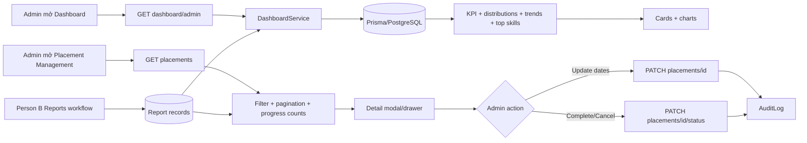

# CareerBridge — Kế hoạch triển khai Tuần 5 cho Người A

## 1. Phạm vi và mục tiêu

**Người thực hiện:** A  
**Tuần:** 5 — Báo cáo và Dashboard  
**Phần Người A:** Admin Dashboard + Placement Management  
**Mức độ:** Medium; chủ yếu là aggregate read model, quản trị lifecycle và frontend biểu đồ

Theo `PLAN.md`, Week 5 được chia như sau:

| Người | Backend | Frontend |
| --- | --- | --- |
| A | Admin dashboard tổng hợp thống kê; hoàn thiện placement management | Dashboard cards/biểu đồ; trang Admin quản lý placement |
| B | Reports CRUD, submit/review workflow, file đính kèm | Student viết/nộp report; Lecturer xem và review report |

Mục tiêu cuối tuần của A:

- Admin xem số liệu thật từ PostgreSQL, không còn `MOCK_DASHBOARD_STATS` hoặc chart hard-code.
- Dashboard lọc được theo semester và định nghĩa mỗi KPI rõ ràng.
- Các số liệu status luôn bao gồm giá trị `0` để frontend render ổn định.
- Admin có trang riêng quản lý placement, tách khỏi trang phân công giảng viên Week 4.
- Admin xem chi tiết placement, tiến độ reports/evaluations và supervision hiện tại.
- Admin chỉnh thời gian thực tập của placement `PENDING`/`ACTIVE` khi cần.
- Admin hoàn tất hoặc hủy placement theo lifecycle, có xác nhận và audit log.
- Không hard delete placement và không làm mất application/report/evaluation history.
- Backend/frontend build thành công; API được kiểm tra bằng curl sau khi implementation.

## 2. Hiện trạng hệ thống cần tôn trọng

### 2.1. Phần đã hoàn thành trước Week 5

- Auth JWT, refresh cookie, `JwtAuthGuard`, `RolesGuard`, `@Roles()` và `@CurrentUser()`.
- API prefix `/api/v1`; success response `{ success: true, data, timestamp }`.
- Global validation bật `whitelist`, `forbidNonWhitelisted`, `transform`.
- User/Profile, Company moderation, Skills, Semester và phần backend/frontend của A Week 4.
- `PlacementsModule` hiện có:
  - Admin list/filter/pagination.
  - `/placements/me` theo role.
  - Participant authorization cho detail.
  - Status transition `COMPLETED`/`CANCELLED`.
  - Helper transaction-aware để Application của B tạo placement.
- `SupervisionsModule` hiện có assign/reassign/reactivate/cancel và lecturer workload.
- Frontend Week 4 có:
  - `SupervisionManagement` cho Admin phân công giảng viên.
  - `PlacementOverview` cho Student.
  - `SupervisedPlacements` cho Lecturer.
  - Typed clients trong `placements/` và `supervisions/`.
- Seed có placement `ACTIVE` đã phân công và placement `PENDING` chưa phân công.

### 2.2. Phần chưa có hoặc còn mock

- `Backend/src/dashboard/dashboard.module.ts` vẫn là skeleton, chưa có controller/service/DTO.
- `Frontend/src/components/AdminView/AdminDashboard.tsx` đang dùng:
  - `MOCK_DASHBOARD_STATS`.
  - Monthly trend hard-code.
  - Skill demand hard-code.
  - Pie distribution hard-code.
  - Các câu so sánh như “+12% so với kỳ trước” không có nguồn dữ liệu thật.
- Chưa có trang Admin placement management độc lập.
- `SupervisionManagement` Week 4 thiên về assignment, không nên gánh thêm toàn bộ lifecycle/date/progress của placement.
- `ReportsModule` thuộc B và có thể được triển khai song song trong Week 5.

### 2.3. Schema hiện tại đủ dùng

Các model cần cho A Week 5 đã tồn tại:

- `User`, `StudentProfile`, `LecturerProfile`, `CompanyProfile`.
- `Semester`, `Internship`, `InternshipSkill`, `Skill`.
- `Application`, `ApplicationStatusHistory`.
- `InternshipPlacement`, `Supervision`.
- `Report`, `Evaluation`.
- `AuditLog`.

Không cần migration cho phạm vi chuẩn Week 5 của A.

Không thêm bảng snapshot/dashboard cache ở tuần này. Chỉ cân nhắc materialized view/cache khi dữ liệu thực tế cho thấy aggregate chậm.

## 3. Ranh giới ownership giữa Người A và Người B

### 3.1. Người A sở hữu

- `DashboardModule` và toàn bộ Admin dashboard read model.
- Công thức KPI, status distribution, monthly trend và top skill demand.
- Placement management API/UI.
- Placement date adjustment và placement lifecycle management.
- Audit cho mutation placement.
- Hiển thị report/evaluation **summary counts** trong placement management.

### 3.2. Người B sở hữu

- Create/update report draft.
- Submit report.
- Lecturer approve/reject report và feedback.
- Report file association, preview/download và signed URL workflow.
- Nội dung report, validation week number và report review authorization.

### 3.3. Quy tắc tránh dependency vòng

- `DashboardModule` chỉ import `PrismaModule`.
- Dashboard đọc aggregate `Report` trực tiếp qua transaction client; không inject `ReportsService`.
- `PlacementsModule` không import `ReportsModule`.
- `ReportsModule` của B có thể import `PlacementsModule` nếu cần helper read/authorization, nhưng chiều ngược lại không được xảy ra.
- A không thêm report mutation vào `PlacementsService`.
- A không trả report content/file URL trong dashboard hoặc placement list.

## 4. Kiến trúc luồng Week 5



## 5. Dashboard scope và định nghĩa dữ liệu

### 5.1. Scope theo semester

Dashboard hỗ trợ:

- `semesterId` có giá trị: số liệu nghiệp vụ chỉ tính các internship/application/placement/report thuộc semester đó.
- Không có `semesterId`: số liệu nghiệp vụ toàn hệ thống.
- Các số liệu identity/profile toàn cục không bị thay đổi bởi semester filter.

Response phải tách rõ:

- `global`: dữ liệu toàn hệ thống như user/profile/company.
- `scope`: mô tả filter hiện tại.
- `kpis`: số liệu nghiệp vụ trong scope.

Điều này tránh lỗi UI ghi “Tổng sinh viên” nhưng thực tế lại chỉ đếm sinh viên có application trong một semester.

### 5.2. Công thức KPI toàn cục

```text
global.totalStudents        = count StudentProfile
global.activeStudentUsers   = count User(role=STUDENT, status=ACTIVE, có StudentProfile)
global.totalLecturers       = count LecturerProfile
global.activeLecturerUsers  = count User(role=LECTURER, status=ACTIVE, có LecturerProfile)
global.approvedCompanies    = count CompanyProfile(status=APPROVED)
global.pendingCompanies     = count CompanyProfile(status=PENDING)
```

Không dùng `User` count đơn thuần để thay cho profile count vì tài khoản có thể chưa hoàn thiện profile.

### 5.3. Công thức KPI theo scope

```text
kpis.totalInternships       = internship count trong scope, gồm mọi status
kpis.openInternships        = internship count status OPEN
kpis.totalSlots             = sum Internship.slots trong scope, loại CANCELLED
kpis.filledSlots            = sum Internship.filledSlots trong scope, loại CANCELLED
kpis.slotOccupancyRate      = filledSlots / totalSlots * 100

kpis.totalApplications      = application count qua internship trong scope
kpis.acceptedApplications   = application count status ACCEPTED
kpis.applicantStudents      = distinct studentId có application trong scope

kpis.totalPlacements        = placement count trong scope
kpis.activePlacements       = placement count status ACTIVE
kpis.pendingPlacements      = placement count status PENDING
kpis.completedPlacements    = placement count status COMPLETED
kpis.cancelledPlacements    = placement count status CANCELLED
kpis.unassignedPlacements   = PENDING placement không có ACTIVE supervision
kpis.placedStudents         = distinct studentId có placement PENDING/ACTIVE/COMPLETED
kpis.placementCoverageRate  = placedStudents / applicantStudents * 100

kpis.reportsAwaitingReview  = report count status SUBMITTED trong scope
```

Quy tắc tỷ lệ:

- Mẫu số bằng `0` thì trả `0`, không trả `NaN`, `Infinity` hoặc `null`.
- Làm tròn một chữ số thập phân ở backend.
- Không tự cộng các placement `CANCELLED` vào `placedStudents`.
- `placementCoverageRate` phải dùng distinct student, không dùng placement/application count.

### 5.4. Status distributions

Response luôn trả đủ enum và giữ thứ tự cố định:

```json
{
  "applicationStatus": [
    { "status": "PENDING", "count": 0 },
    { "status": "REVIEWING", "count": 0 },
    { "status": "ACCEPTED", "count": 0 },
    { "status": "REJECTED", "count": 0 },
    { "status": "WITHDRAWN", "count": 0 }
  ],
  "placementStatus": [
    { "status": "PENDING", "count": 0 },
    { "status": "ACTIVE", "count": 0 },
    { "status": "COMPLETED", "count": 0 },
    { "status": "CANCELLED", "count": 0 }
  ],
  "reportStatus": [
    { "status": "DRAFT", "count": 0 },
    { "status": "SUBMITTED", "count": 0 },
    { "status": "APPROVED", "count": 0 },
    { "status": "REJECTED", "count": 0 }
  ]
}
```

Không để frontend tự đoán status bị thiếu nghĩa là `0`.

### 5.5. Monthly trend

Query nhận `months` từ `3..12`, mặc định `6`.

Mỗi point:

```json
{
  "month": "2026-08",
  "label": "T08/2026",
  "applications": 12,
  "placements": 5,
  "completedPlacements": 1
}
```

Quy tắc:

- Khoảng thời gian gồm tháng hiện tại và `months - 1` tháng trước.
- Filter semester vẫn áp dụng đồng thời.
- Tháng không có dữ liệu vẫn trả point count `0`.
- Application group theo `appliedAt`.
- Placement group theo `createdAt`; completed placement được group theo `updatedAt` trong phạm vi Week 5 vì schema chưa có `completedAt` riêng.
- Frontend phải ghi chú nguồn completed trend dùng thời điểm cập nhật status, tránh hiểu nhầm.
- Không fetch toàn bộ record về Node để group khi dữ liệu lớn; ưu tiên parameterized `$queryRaw` với `date_trunc('month', ...)` hoặc bounded query đã được chứng minh đủ nhẹ.
- Tuyệt đối không nối trực tiếp string từ query parameter vào raw SQL; dùng `Prisma.sql`/parameter binding.

### 5.6. Top skill demand

Mỗi item:

```json
{
  "skillId": "...",
  "name": "NestJS",
  "internshipCount": 8,
  "requiredCount": 6,
  "weightSum": 24
}
```

Quy tắc:

- Chỉ tính internship không `CANCELLED` trong scope.
- Một skill chỉ đếm tối đa một lần trên mỗi internship do composite PK hiện tại.
- Sort: `internshipCount desc`, sau đó `requiredCount desc`, sau đó `name asc`.
- Trả tối đa 5 skills.
- Dùng `groupBy` + một query lấy skill name; không query skill trong loop.

## 6. Thiết kế API Dashboard

### 6.1. `GET /api/v1/dashboard/admin`

Quyền: `ADMIN`.

Query:

```text
semesterId?: string
months?: number = 6, min 3, max 12
```

Validation:

- `semesterId` không rỗng nếu được gửi.
- Semester không tồn tại trả `404 SEMESTER_NOT_FOUND`.
- `months` ngoài `3..12` trả `400 VALIDATION_ERROR`.
- Sai role trả `403 FORBIDDEN_ROLE`.

Response đề xuất:

```json
{
  "scope": {
    "semester": null,
    "months": 6,
    "from": "2026-03-01T00:00:00.000Z",
    "to": "2026-08-31T23:59:59.999Z",
    "generatedAt": "2026-08-22T...Z"
  },
  "global": {
    "totalStudents": 500,
    "activeStudentUsers": 480,
    "totalLecturers": 30,
    "activeLecturerUsers": 28,
    "approvedCompanies": 50,
    "pendingCompanies": 3
  },
  "kpis": {
    "totalInternships": 200,
    "openInternships": 82,
    "totalSlots": 950,
    "filledSlots": 680,
    "slotOccupancyRate": 71.6,
    "totalApplications": 1240,
    "acceptedApplications": 680,
    "applicantStudents": 720,
    "totalPlacements": 680,
    "pendingPlacements": 35,
    "activePlacements": 590,
    "completedPlacements": 50,
    "cancelledPlacements": 5,
    "unassignedPlacements": 35,
    "placedStudents": 675,
    "placementCoverageRate": 93.8,
    "reportsAwaitingReview": 20
  },
  "distributions": {
    "applicationStatus": [],
    "placementStatus": [],
    "reportStatus": []
  },
  "monthlyTrend": [],
  "topSkills": []
}
```

### 6.2. Không tạo các endpoint sau trong Week 5

- Không tạo dashboard mutation endpoint.
- Không tạo endpoint trả toàn bộ raw application/report để frontend tự aggregate.
- Không tạo endpoint riêng cho từng card nếu mọi card dùng cùng scope; tránh nhiều round-trip và snapshot lệch nhau.
- Không mở Admin dashboard cho Student/Company/Lecturer.
- Không đưa email, CV URL, report content hoặc audit metadata vào response dashboard.

## 7. Thiết kế backend Dashboard

### 7.1. Cấu trúc module

```text
Backend/src/dashboard/
├── dto/
│   └── admin-dashboard-query.dto.ts
├── dashboard.types.ts
├── dashboard.controller.ts
├── dashboard.service.ts
└── dashboard.module.ts
```

### 7.2. Controller

```text
@Controller('dashboard')
@UseGuards(JwtAuthGuard, RolesGuard)

GET /admin
@Roles(Role.ADMIN)
```

### 7.3. Service query strategy

- Resolve semester một lần nếu có `semesterId`.
- Xây `internshipWhere`, `applicationWhere`, `placementWhere`, `reportWhere` dùng chung.
- Các count/status query chạy trong read transaction isolation `RepeatableRead` để cùng một response có snapshot nhất quán.
- Không mở transaction dài khi chạy logic format/chart bên ngoài DB; chỉ giữ phần query trong transaction.
- Status distribution dùng Prisma `groupBy` rồi normalize theo enum cố định.
- Sum slot dùng `_sum` aggregate.
- Distinct student dùng `findMany({ distinct: ['studentId'], select: { studentId: true } })` hoặc raw count distinct có parameter binding.
- Top skills dùng group query; không N+1.
- Trend raw SQL phải parameterized.
- Set timeout hợp lý và log query chậm ở development; không log dữ liệu cá nhân.

### 7.4. Index audit trước khi migration

Schema hiện có các index chính:

- Application: `(internshipId, status)`, `(studentId, status)`.
- Placement: `(studentId, semesterId)`, `(companyId, semesterId)`, `(semesterId, status)`.
- Report: `(placementId, status)`.
- Internship: `(semesterId, status)`, `(companyId, status)`.

Chỉ tạo migration bổ sung khi `EXPLAIN ANALYZE` chứng minh query trend/filter cần index mới. Không thêm index theo cảm tính.

Candidate có thể xem xét nếu data lớn:

```text
Application(appliedAt)
InternshipPlacement(createdAt)
InternshipPlacement(status, createdAt)
```

Các candidate này không nằm trong Definition of Done mặc định.

### 7.5. Dashboard caching

- Không cache trong Week 5 mặc định.
- Không dùng Redis nếu project chưa có Redis lifecycle.
- Nếu aggregate thực tế vượt 500 ms ổn định, có thể thêm in-memory TTL 15–30 giây theo key `semesterId:months`.
- Cache là optional; phải invalidate hoặc chấp nhận eventual consistency và ghi rõ.
- Không đưa caching vào trước khi curl/database assertions xác nhận số liệu đúng.

## 8. Placement Management — phạm vi nâng cấp từ Week 4

### 8.1. Giữ nguyên những gì đã đúng

- Placement chỉ được tạo từ accept Application transaction.
- Không public `POST /placements`.
- Không hard delete placement.
- Participant authorization ở detail.
- `PENDING -> ACTIVE` chỉ qua supervision assignment.
- `COMPLETED` và `CANCELLED` terminal.
- Cancel giảm `filledSlots` tối đa một lần.

### 8.2. Nâng cấp list response

List Admin bổ sung progress summary:

```json
{
  "progress": {
    "reportCount": 4,
    "evaluationCount": 0,
    "reportsAwaitingReview": 1
  }
}
```

Không include report content hoặc file metadata trong list.

Sử dụng `_count`/filtered count hoặc aggregate theo page IDs trong một query bổ sung; không count từng placement trong loop.

Đồng thời chuẩn hóa assignment semantics:

- `ASSIGNED` chỉ khi supervision hiện tại có status `ACTIVE`.
- `UNASSIGNED` khi supervision `null`, `CANCELLED` hoặc `COMPLETED` nhưng placement chưa terminal.
- Không dùng điều kiện đơn giản `supervision is null/is not null`, vì Week 4 cố ý giữ record supervision `CANCELLED` để bảo toàn lịch sử và cho phép reactivate.
- Response nên có `assignmentStatus: ASSIGNED | UNASSIGNED` được backend tính rõ, không để frontend suy luận chỉ từ `supervision !== null`.

### 8.3. Nâng cấp list query

Giữ query Week 4:

```text
page, limit, search, status, semesterId, companyId, lecturerId, assignmentStatus
```

Bổ sung:

```text
reportStatus?: DRAFT | SUBMITTED | APPROVED | REJECTED
```

Ý nghĩa: placement có ít nhất một report thuộc status được chọn.

`assignmentStatus` Week 4 phải được sửa theo supervision status:

```text
ASSIGNED   -> supervision.status = ACTIVE
UNASSIGNED -> không có supervision ACTIVE
```

Không thêm quá nhiều filter chưa có nhu cầu UI thật.

### 8.4. Placement detail progress

`GET /placements/:id` bổ sung:

```json
{
  "progress": {
    "reportCount": 4,
    "draftReports": 1,
    "submittedReports": 1,
    "approvedReports": 2,
    "rejectedReports": 0,
    "evaluationCount": 0,
    "lastReportAt": "2026-08-20T...Z"
  }
}
```

Không trả report feedback/content; Admin muốn xem report cụ thể sẽ dùng endpoint Reports của B.

### 8.5. Chỉnh thời gian placement

Tạo endpoint:

```text
PATCH /api/v1/placements/:id
Role: ADMIN
Body:
{
  "startDate"?: ISO date-time,
  "endDate"?: ISO date-time
}
```

Quy tắc:

- Chỉ placement `PENDING` hoặc `ACTIVE` được chỉnh.
- Phải có ít nhất một field.
- Sau merge, `startDate < endDate`.
- Nếu một field còn `null`, cho phép lưu field còn lại; UI cảnh báo lịch chưa đầy đủ.
- Ngày phải nằm trong khoảng semester start/end.
- Không tự update Internship date; placement là lịch thực tế riêng sau khi accept.
- Mutation + audit `PLACEMENT_SCHEDULE_UPDATED` trong cùng transaction.
- Audit metadata ghi before/after dates, không ghi dữ liệu nhạy cảm.
- Map concurrent/terminal update thành `409 PLACEMENT_IMMUTABLE`.

### 8.6. Nâng cấp status endpoint

Body:

```json
{
  "status": "COMPLETED",
  "note": "Đã kết thúc kỳ thực tập"
}
```

hoặc:

```json
{
  "status": "CANCELLED",
  "note": "Doanh nghiệp dừng chương trình"
}
```

Quy tắc:

- `note` optional, trim, max 500; frontend yêu cầu nhập lý do khi cancel dù backend giữ tương thích bằng optional.
- Public DTO vẫn chỉ nhận `COMPLETED | CANCELLED`.
- Complete chỉ từ `ACTIVE`.
- Cancel từ `PENDING | ACTIVE`.
- Terminal không mở lại.
- Complete supervision ACTIVE cùng transaction.
- Cancel supervision ACTIVE cùng transaction.
- Cancel decrement slot với status precondition để không giảm lần hai.
- Mutation dùng optimistic condition/status check trong transaction để chống hai request đồng thời.
- Audit ghi `note`, before/after status và liên quan supervision.

### 8.7. Completion và Reports/Evaluations

Week 5 chưa bắt buộc có evaluation vì Evaluations thuộc Week 6.

Không chặn completion chỉ vì evaluation chưa có.

Đối với report:

- UI hiển thị cảnh báo nếu còn report `SUBMITTED` chưa review.
- Backend Week 5 có thể từ chối complete nếu `reportsAwaitingReview > 0` bằng `409 PLACEMENT_HAS_PENDING_REPORTS`.
- Không chặn nếu chỉ có `DRAFT`, vì Student có thể bỏ draft không dùng.
- Quy tắc này phải thống nhất với B trước khi code; plan mặc định **bật chặn SUBMITTED** để không đóng placement khi lecturer chưa xử lý báo cáo đã nộp.

## 9. Thiết kế API Placement Week 5

### 9.1. Endpoint matrix

| Method | Endpoint | Role | Mục đích |
| --- | --- | --- | --- |
| GET | `/placements` | ADMIN | List/filter/pagination + progress summary |
| GET | `/placements/me` | STUDENT, COMPANY, LECTURER, ADMIN | View placement theo scope |
| GET | `/placements/:id` | Participant, ADMIN | Detail + progress summary |
| PATCH | `/placements/:id` | ADMIN | Update placement schedule |
| PATCH | `/placements/:id/status` | ADMIN | Complete/cancel placement |

### 9.2. Error codes bổ sung

| HTTP | Code | Trường hợp |
| --- | --- | --- |
| 400 | `PLACEMENT_UPDATE_EMPTY` | Không có schedule field |
| 400 | `INVALID_PLACEMENT_DATE_RANGE` | Start không trước end hoặc ngoài semester |
| 403 | `PLACEMENT_NOT_ACCESSIBLE` | User không phải participant |
| 404 | `PLACEMENT_NOT_FOUND` | Placement không tồn tại |
| 409 | `PLACEMENT_IMMUTABLE` | Terminal placement bị chỉnh |
| 409 | `INVALID_PLACEMENT_TRANSITION` | Lifecycle sai |
| 409 | `PLACEMENT_HAS_PENDING_REPORTS` | Complete khi còn report SUBMITTED |
| 409 | `PLACEMENT_STATUS_CONFLICT` | Concurrent update làm status đã đổi |

## 10. Thiết kế backend Placement

### 10.1. Cấu trúc file bổ sung

```text
Backend/src/placements/
├── dto/
│   ├── list-placements-query.dto.ts        # extend reportStatus
│   ├── update-placement.dto.ts             # new schedule DTO
│   └── update-placement-status.dto.ts       # extend note
├── placements.controller.ts                # add PATCH :id before status route
├── placements.service.ts
└── placements.module.ts
```

Route order phải rõ; `PATCH ':id/status'` không bị route generic xử lý sai.

### 10.2. Shared Prisma select

- Giữ một `placementSelect` cho identity/nested summaries.
- Không duplicate select lớn giữa list/detail/update.
- List progress count phải bounded theo current page.
- Detail progress group theo report status bằng một aggregate query.
- Mapper trả response shape nhất quán cho list/update/detail.

### 10.3. Transaction schedule update

```text
BEGIN SERIALIZABLE
  load placement + semester
  assert status PENDING/ACTIVE
  merge existing and DTO dates
  validate date range + semester bounds
  updateMany where id + current status
  if count != 1 -> PLACEMENT_STATUS_CONFLICT
  audit PLACEMENT_SCHEDULE_UPDATED
COMMIT
```

### 10.4. Transaction completion

```text
BEGIN SERIALIZABLE
  load placement + active supervision
  assert ACTIVE -> COMPLETED
  count SUBMITTED reports
  if submitted > 0 -> 409
  update placement with status precondition
  complete active supervision + completedAt
  audit placement + supervision
COMMIT
```

### 10.5. Transaction cancellation

```text
BEGIN SERIALIZABLE
  load placement + supervision
  assert PENDING/ACTIVE -> CANCELLED
  update placement with status precondition
  cancel active supervision
  atomic decrement filledSlots where filledSlots > 0
  audit placement + supervision + note
COMMIT
```

Nếu transaction conflict Prisma `P2034`, retry bounded tối đa 2–3 lần; không retry validation/business exception.

## 11. Thiết kế frontend Dashboard

### 11.1. File structure

```text
Frontend/src/dashboard/
├── api.ts
└── types.ts

Frontend/src/components/AdminView/
└── AdminDashboard.tsx            # rewrite API-backed
```

### 11.2. Typed response

Tạo types khớp hoàn toàn response backend:

- `AdminDashboardData`.
- `DashboardScope`.
- `DashboardGlobalStats`.
- `DashboardKpis`.
- `StatusCount<T>`.
- `MonthlyTrendPoint`.
- `TopSkillDemand`.

Không tiếp tục dùng `DashboardStats` cũ trong `Frontend/src/types.ts` cho màn thật.

### 11.3. Data loading

- Load semester options từ `semestersApi.list({ page: 1, limit: 100 })`.
- Load dashboard bằng `dashboardApi.getAdmin({ semesterId, months })`.
- Semester filter mặc định `ALL` để đúng semantics backend.
- Khi đổi semester/months, fetch lại dashboard.
- Debounce không cần cho select; chống response cũ ghi đè response mới bằng request sequence/AbortController nếu axios integration cho phép.
- Có loading skeleton, error state + nút retry, zero-data state.
- Không giữ mock fallback âm thầm khi API lỗi.

### 11.4. Dashboard layout chuyên nghiệp

Khu vực 1 — Header:

- Tên dashboard.
- Semester filter.
- Range `3/6/9/12 tháng`.
- `generatedAt` để Admin biết thời điểm snapshot.

Khu vực 2 — Primary KPI cards:

- Tổng sinh viên.
- Doanh nghiệp approved/pending.
- Internship open/total.
- Application accepted/total.
- Placement active/total.
- Report đang chờ review.

Khu vực 3 — Rate cards:

- Placement coverage rate.
- Slot occupancy rate.
- Unassigned placement count với link sang tab phân công.

Khu vực 4 — Charts:

- Area/line chart: applications vs placements theo tháng.
- Donut chart: placement status distribution.
- Horizontal bar chart: top skills demand.
- Optional compact bar: report status distribution khi B đã có data.

Khu vực 5 — Operational alerts:

- Pending company approvals.
- Unassigned placements.
- Submitted reports awaiting review.

Mỗi alert có CTA điều hướng tới tab phù hợp; không thực hiện mutation trong dashboard.

### 11.5. Chart rules

- Dùng `recharts` đã có, không thêm chart dependency.
- Tooltip tiếng Việt, label rõ đơn vị.
- Không hard-code percentages khiến tổng pie khác 100.
- Với count distribution, donut dùng count thật và center label tổng.
- Zero total hiển thị empty state, không render pie lỗi.
- Màu status nhất quán với Placement Management.
- Chart container có chiều cao cố định để không layout shift.
- Responsive ở desktop/tablet; trên mobile chart xếp một cột.

## 12. Thiết kế frontend Placement Management

### 12.1. File structure

```text
Frontend/src/components/AdminView/
├── PlacementManagement.tsx
├── PlacementDetailDrawer.tsx      # optional split nếu file quá lớn
└── PlacementStatusModal.tsx       # optional split

Frontend/src/placements/
├── api.ts                         # extend update/list params
└── types.ts                       # extend progress/date inputs
```

### 12.2. Navigation

Admin Navbar có hai tab riêng:

- `teacher-assignment`: Phân công giảng viên — Week 4.
- `placement-management`: Quản lý placement — Week 5.

Không gộp hai tab vì hai workflow khác nhau:

- Assignment trả lời “ai hướng dẫn placement này?”.
- Placement management trả lời “placement đang ở giai đoạn nào và có cần xử lý lifecycle/schedule không?”.

### 12.3. Placement list UI

Header cards:

- Tổng placement trong filter hiện tại.
- PENDING.
- ACTIVE.
- COMPLETED.
- CANCELLED.

Filters:

- Search student code/name, internship title, company.
- Semester.
- Placement status.
- Lecturer.
- Assignment status.
- Report status.

Table columns:

- Student.
- Internship/company.
- Semester và schedule.
- Lecturer.
- Placement status.
- Progress: report/evaluation counts, submitted report badge.
- Actions.

Server pagination; không filter array mock.

### 12.4. Detail drawer/modal

Sections:

1. Student summary.
2. Internship/company summary.
3. Semester and actual schedule.
4. Current supervision.
5. Report/evaluation progress summary.
6. Lifecycle actions.

Không render CV/report content trong drawer.

### 12.5. Schedule edit

- Date inputs prefill từ placement.
- Hiển thị semester bounds.
- Client validate start < end và trong semester trước khi request.
- Disable form khi placement terminal.
- Saving state chống double-submit.
- Success reload detail + current table row.

### 12.6. Complete/cancel UX

Complete:

- Chỉ hiện khi placement ACTIVE.
- Confirmation nêu rõ supervision cũng được complete.
- Nếu backend trả pending reports, hiển thị message rõ và CTA sang Reports review.

Cancel:

- Hiện khi PENDING/ACTIVE.
- Modal yêu cầu nhập lý do ở UI, tối đa 500 ký tự.
- Cảnh báo application/report/evaluation history được giữ lại.
- Cảnh báo slot sẽ được release.
- Không dùng `window.confirm` cho action quan trọng nếu đã có modal design.

### 12.7. Không duplicate assignment UI

- Placement page chỉ hiển thị lecturer và link “Mở phân công”.
- Assign/reassign/cancel supervision vẫn nằm ở `SupervisionManagement`.
- Nếu placement PENDING chưa lecturer, CTA điều hướng `teacher-assignment` với search/placement context nếu kiến trúc tab hiện tại hỗ trợ.

## 13. Seed data Week 5

Mục tiêu seed là dashboard có biểu đồ và placement management có đủ state.

Fixture đề xuất:

| Fixture | Semester | Placement | Supervision | Report |
| --- | --- | --- | --- | --- |
| Existing active | Seed Semester 2026 | ACTIVE | ACTIVE | Do B thêm nếu cần |
| Existing pending | Seed Semester 2026 | PENDING | null | none |
| Historical completed | Seed Semester 2025 | COMPLETED | COMPLETED | Do B thêm summary fixtures |
| Historical cancelled | Seed Semester 2025 hoặc 2026 | CANCELLED | CANCELLED/null | none |

Quy tắc ownership seed:

- A seed placement/supervision lịch sử bằng fixed IDs.
- B seed report/file metadata bằng fixed IDs.
- Không tạo report giả từ A nếu B đang chỉnh schema/seed report.
- Application tương ứng placement phải `ACCEPTED` và thuộc đúng internship/student/company/semester.
- `filledSlots` của mỗi internship phải khớp số accepted placement chưa release.
- Upsert bằng fixed ID/unique key; seed chạy lại không duplicate.
- Không broad `deleteMany` placement/report/audit thực.

## 14. Trình tự triển khai đề xuất

### Ngày 1 — Dashboard backend contract

- Tạo DTO/controller/service/module Dashboard.
- Implement scope resolver và KPI counts.
- Implement status distributions.
- Normalize zero statuses.
- Backend build.

### Ngày 2 — Dashboard analytics + Placement backend

- Implement monthly trend parameterized query.
- Implement top skill demand.
- Extend placement progress list/detail.
- Add update schedule endpoint.
- Strengthen status transaction/note/pending reports guard.
- Audit log.
- Backend lint/build.

### Ngày 3 — Seed + curl + database assertions

- Bổ sung deterministic placement history fixtures.
- Curl dashboard RBAC/filter/zero/rate cases.
- Curl schedule/lifecycle cases.
- Cross-check selected KPI bằng direct database query.
- Kiểm tra concurrent status request và slot decrement once.

### Ngày 4 — Dashboard frontend

- Tạo dashboard API/types.
- Rewrite AdminDashboard từ mock sang API thật.
- Semester/month range filters.
- KPI cards/charts/alerts/loading/error/zero states.
- Frontend lint/build.

### Ngày 5 — Placement Management frontend + QA

- Tạo dedicated Admin placement tab.
- Detail drawer, schedule form, complete/cancel modals.
- Link placement ↔ assignment/report tabs.
- Responsive/console/network QA.
- Full flow: Dashboard alert → placement list → detail → lifecycle action → dashboard refresh.

## 15. Kế hoạch kiểm thử bằng curl

Theo lựa chọn của nhóm, không bắt buộc unit test cho phạm vi này; dùng build, lint, curl và database assertions có mục tiêu.

### 15.1. Dashboard authentication/RBAC

| Case | Expected |
| --- | --- |
| Không token | `401` |
| Student/Company/Lecturer gọi Admin dashboard | `403 FORBIDDEN_ROLE` |
| Admin gọi không filter | `200` toàn hệ thống |
| Admin filter semester hợp lệ | `200`, scope đúng semester |
| Semester không tồn tại | `404 SEMESTER_NOT_FOUND` |
| `months=2` hoặc `13` | `400 VALIDATION_ERROR` |

### 15.2. Dashboard data correctness

| Case | Expected |
| --- | --- |
| DB không có record một status | Response vẫn có status count 0 |
| Không application trong scope | coverage rate 0, không NaN |
| Không slot trong scope | occupancy rate 0 |
| Semester A/B | Count không leak giữa semester |
| Tổng status distribution | Bằng total tương ứng |
| Trend range | Đúng số tháng, tháng trống count 0 |
| Top skill | Tối đa 5, order đúng |
| reportsAwaitingReview | Bằng count Report SUBMITTED trong scope |

### 15.3. Placement management read

| Case | Expected |
| --- | --- |
| Admin list progress | Counts đúng, pagination đúng |
| Filter reportStatus | Chỉ placement có report status đó |
| Admin detail | Có progress summary |
| Participant detail | `200` đúng scope |
| User khác detail | `403 PLACEMENT_NOT_ACCESSIBLE` |
| List query không hợp lệ | `400` |

### 15.4. Schedule update

| Case | Expected |
| --- | --- |
| Admin update ACTIVE schedule hợp lệ | `200`, audit created |
| Student update schedule | `403` |
| Body rỗng | `400 PLACEMENT_UPDATE_EMPTY` |
| start >= end | `400 INVALID_PLACEMENT_DATE_RANGE` |
| Date ngoài semester | `400 INVALID_PLACEMENT_DATE_RANGE` |
| Update terminal placement | `409 PLACEMENT_IMMUTABLE` |

### 15.5. Lifecycle

| Case | Expected |
| --- | --- |
| ACTIVE → COMPLETED không pending report | Placement + supervision COMPLETED |
| ACTIVE → COMPLETED còn SUBMITTED report | `409 PLACEMENT_HAS_PENDING_REPORTS` |
| PENDING → CANCELLED | Placement CANCELLED, slot giảm một lần |
| ACTIVE → CANCELLED | Placement + supervision CANCELLED, slot giảm một lần |
| Cancel terminal lại | `409`, slot không giảm lần hai |
| PENDING → COMPLETED | `409 INVALID_PLACEMENT_TRANSITION` |
| Public request ACTIVE | `400 VALIDATION_ERROR` |
| Hai request status đồng thời | Chỉ một mutation commit |

### 15.6. Database assertions

- `filledSlots >= 0` và `filledSlots <= slots`.
- Placement terminal không có supervision ACTIVE.
- Placement ACTIVE có supervision ACTIVE.
- Status audit có before/after/note.
- Schedule audit có before/after dates.
- Dashboard totals khớp query trực tiếp.
- Không có duplicate placement/application hoặc supervision/placement.

## 16. Checklist frontend

### Dashboard

- Không import `MOCK_DASHBOARD_STATS` trong App/AdminDashboard.
- Không còn monthly/skill/pie data hard-code.
- Semester filter đổi data thật.
- KPI labels đúng semantics global/scoped.
- Rate denominator zero không lỗi.
- Charts render zero state.
- Tooltip/legend tiếng Việt.
- Loading skeleton không layout shift lớn.
- Error state có retry.
- Không request loop khi render.

### Placement Management

- List dùng server pagination.
- Filter reset page về 1.
- Detail hiển thị đúng participant summaries.
- Schedule form validate trước request.
- Terminal placement disable mutation.
- Complete/cancel modal chống double-submit.
- Backend error code map thành thông báo dễ hiểu.
- Sau mutation table/detail/dashboard cập nhật đúng.
- Không duplicate assign lecturer workflow.
- Desktop/tablet/mobile không tràn modal; table cho phép horizontal scroll.

### Quality

- Không React key warning.
- Không console error.
- Không unauthorized request loop.
- `npm run lint` pass.
- `npm run build` pass.
- Bundle warning được ghi nhận; code-splitting optional nếu chưa ảnh hưởng Week 5 DoD.

## 17. Definition of Done

Week 5 của Người A chỉ hoàn thành khi:

- [ ] `DashboardModule` không còn skeleton.
- [ ] Admin dashboard endpoint có RBAC.
- [ ] Semester filter và months validation đúng.
- [ ] Global/scoped KPI definitions đúng contract.
- [ ] Status distributions luôn trả đủ enum.
- [ ] Tỷ lệ zero-safe và làm tròn nhất quán.
- [ ] Monthly trend không hard-code và parameterized an toàn.
- [ ] Top skills không N+1.
- [ ] Frontend Dashboard không còn mock stats/charts.
- [ ] Dashboard loading/error/zero/responsive states hoạt động.
- [ ] Placement list/detail có progress summary.
- [ ] Assignment filter dựa trên supervision ACTIVE, không dựa trên relation tồn tại.
- [ ] Admin update schedule đúng validation/lifecycle.
- [ ] Complete/cancel transaction an toàn và audit đầy đủ.
- [ ] Complete bị chặn khi còn report SUBMITTED.
- [ ] Cancel slot decrement đúng một lần.
- [ ] Có dedicated Placement Management UI.
- [ ] Assignment UI Week 4 vẫn hoạt động độc lập.
- [ ] Seed đủ dữ liệu dashboard/placement, chạy lại không duplicate.
- [ ] Backend lint/build thành công.
- [ ] Frontend lint/build thành công.
- [ ] Curl RBAC/negative/data correctness/concurrency đạt.
- [ ] Không làm hỏng Auth, Applications, Supervisions, Semester, Skills và Week 4 frontend.

## 18. Hạng mục không làm trong Week 5 của A

- Không implement Reports CRUD/review/file của B.
- Không implement Evaluations mutation của Week 6.
- Không implement Notifications hoặc notification badge thật của Week 6.
- Không implement Chat/realtime.
- Không tạo public dashboard cho mọi role nếu roadmap chỉ yêu cầu Admin.
- Không export Excel/PDF dashboard.
- Không tạo custom date-range dashboard tùy ý; chỉ semester + bounded month range.
- Không thêm Redis/materialized view khi chưa đo performance.
- Không hard delete placement/report/evaluation history.
- Không auto-complete placement dựa trên ngày.
- Không cho frontend tự aggregate bằng cách tải toàn bộ records.

## 19. Bàn giao và điểm tích hợp cho Người B

Người A bàn giao cho B:

- Dashboard chỉ đọc `Report` counts theo status; không gọi ReportsService.
- Placement detail/list chỉ trả progress counts, không trả report content.
- Error `PLACEMENT_HAS_PENDING_REPORTS` khi complete còn report SUBMITTED.
- Placement status/date contract để B guard report workflow.

Người B cần bảo đảm:

- Chỉ placement ACTIVE mới cho submit report.
- Lecturer review phải là lecturer của supervision ACTIVE tương ứng.
- Report status transition cập nhật đúng để dashboard count chính xác.
- Report records luôn gắn `placementId`, không gắn student đơn lẻ.
- Khi A test dashboard trước khi Reports hoàn thành, report counts hợp lệ ở `0`.

## 20. Rủi ro cần tránh

- Dashboard gọi nhiều endpoint/card khiến số liệu lệch snapshot và UI waterfall.
- KPI “tỷ lệ có nơi thực tập” dùng application count làm denominator.
- Đếm placement thay cho distinct student.
- Semester filter chỉ áp dụng một số query nhưng bỏ sót reports/skills.
- Status groupBy thiếu status 0 làm chart crash hoặc đổi màu sai.
- Raw SQL nối query string trực tiếp gây SQL injection.
- Fetch toàn bộ application/placement về Node để aggregate không bounded.
- DashboardService import ReportsService gây dependency vòng.
- Placement list query progress từng row gây N+1.
- Gộp placement lifecycle vào assignment screen khiến UI quá tải.
- Cho Admin sửa `studentId/companyId/internshipId/semesterId/applicationId`.
- Complete placement khi report SUBMITTED chưa review.
- Cancel placement decrement slot nhiều lần.
- Mutation terminal record không dùng status precondition, gây race condition.
- Giữ `MOCK_DASHBOARD_STATS` làm fallback khi API lỗi và khiến Admin tưởng dữ liệu thật.
- Pie chart dùng percentage hard-code không cộng thành 100.
- Frontend chỉ kiểm tra happy path mà không kiểm tra zero/error/loading states.
