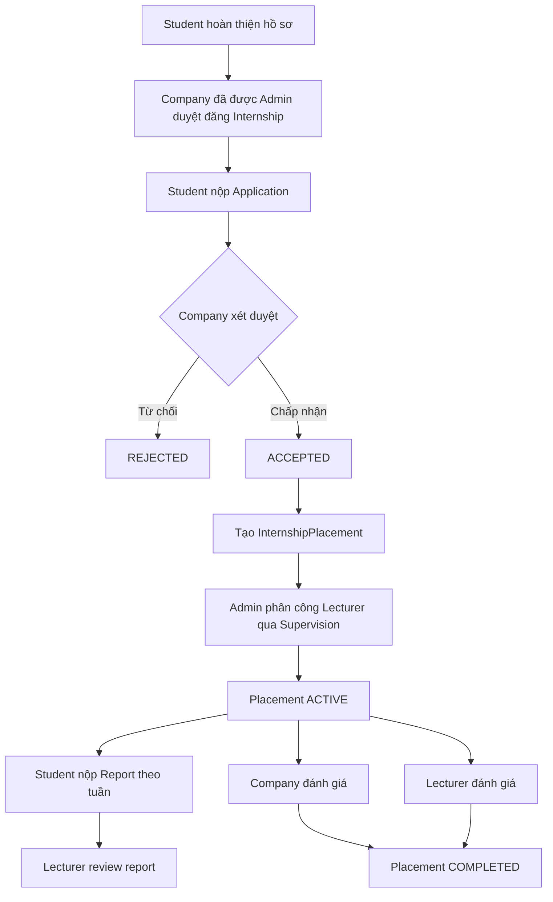

# InternHub — Yêu cầu nghiệp vụ

## 1. Mục tiêu

InternHub là hệ thống hỗ trợ nhà trường quản lý toàn bộ vòng đời thực tập: sinh viên tìm và ứng tuyển vị trí, doanh nghiệp tuyển chọn, nhà trường phân công giảng viên, sau đó các bên theo dõi và đánh giá quá trình thực tập.

Hệ thống phục vụ bốn nhóm người dùng:

| Vai trò | Mục tiêu chính |
|---|---|
| `STUDENT` | Hoàn thiện hồ sơ, tìm vị trí, ứng tuyển, nộp báo cáo và xem kết quả. |
| `COMPANY` | Được duyệt hồ sơ doanh nghiệp, đăng vị trí, xét ứng viên và đánh giá thực tập sinh. |
| `LECTURER` | Theo dõi sinh viên được phân công, phản hồi báo cáo và đánh giá. |
| `ADMIN` | Quản trị tài khoản, doanh nghiệp, kỳ thực tập, phân công và theo dõi hệ thống. |

## 2. Phạm vi chức năng

| Phân hệ | Nghiệp vụ |
|---|---|
| Authentication | Đăng ký, đăng nhập, refresh token, đăng xuất và RBAC. |
| Hồ sơ | Hồ sơ sinh viên, dự án cá nhân, kỹ năng, CV; hồ sơ giảng viên và doanh nghiệp. |
| Kỳ thực tập | Tạo và quản lý thời gian, trạng thái của từng kỳ. |
| Vị trí thực tập | Doanh nghiệp đăng vị trí theo kỳ, số lượng tuyển, hạn nộp và kỹ năng yêu cầu. |
| AI gợi ý thực tập | Sinh viên lưu mong muốn công việc và chủ động tạo tối đa 10 gợi ý do backend xếp hạng; AI chỉ diễn giải tối đa 3 gợi ý đầu. |
| Ứng tuyển | Sinh viên nộp đơn, doanh nghiệp xem xét và lưu lịch sử thay đổi trạng thái. |
| Placement | Ghi nhận một đợt thực tập đã được xác nhận từ đơn được chấp nhận. |
| Hướng dẫn | Admin phân công một giảng viên cho placement. |
| Báo cáo | Sinh viên nộp báo cáo tuần; giảng viên phản hồi, duyệt hoặc yêu cầu sửa. |
| Đánh giá | Doanh nghiệp và giảng viên gửi hai đánh giá độc lập cho một placement. |
| Tệp tin | Quản lý metadata tệp CV, báo cáo, chứng chỉ; tệp lưu ở object storage. |
| Trao đổi | Hội thoại giữa sinh viên và doanh nghiệp trong ngữ cảnh một đơn ứng tuyển. |
| Hệ thống | Thông báo, dashboard, audit log. |

## 3. Vòng đời thực tập

`InternshipPlacement` là bản ghi trung tâm của giai đoạn thực tập thực tế. Mọi báo cáo, phân công và đánh giá đều phải gắn với placement, không chỉ gắn với sinh viên. Nhờ đó một sinh viên có thể có dữ liệu lịch sử rõ ràng qua nhiều kỳ hoặc nhiều công ty.

## 4. Quy tắc nghiệp vụ

### 4.1. Doanh nghiệp và vị trí thực tập

- Doanh nghiệp mới đăng ký có trạng thái `PENDING`; chỉ `APPROVED` mới được mở bài đăng.
- Internship luôn thuộc một `Semester`.
- Internship có các trạng thái `DRAFT`, `OPEN`, `CLOSED`, `CANCELLED`.
- Chỉ vị trí `OPEN`, chưa hết hạn và còn chỗ mới nhận đơn.
- `filledSlots` được tăng trong cùng transaction khi chấp nhận ứng viên.

### 4.2. Ứng tuyển và placement

- Một sinh viên chỉ có một application cho cùng một internship.
- Trạng thái application: `PENDING → REVIEWING → ACCEPTED | REJECTED`; sinh viên có thể chuyển đơn chưa kết thúc sang `WITHDRAWN`.
- Khi chấp nhận đơn, hệ thống tạo một `InternshipPlacement` duy nhất cho application đó và ghi `ApplicationStatusHistory`.
- Phải kiểm tra nghiệp vụ để một sinh viên không có nhiều placement `ACTIVE` trong cùng một semester.
- Hủy placement không được xóa lịch sử application, report hay evaluation; chỉ thay đổi trạng thái sang `CANCELLED` khi phù hợp.

### 4.3. Phân công, báo cáo và đánh giá

- Một placement có tối đa một supervision đang hiệu lực; Admin là người tạo hoặc thay đổi phân công.
- Một placement có tối đa một báo cáo cho mỗi tuần (`week`).
- Báo cáo có trạng thái `DRAFT`, `SUBMITTED`, `APPROVED`, `REJECTED`.
- Mỗi placement có tối đa một evaluation loại `COMPANY` và một evaluation loại `LECTURER`.
- Chỉ tài khoản doanh nghiệp của placement hoặc giảng viên được phân công mới được tạo evaluation tương ứng. Quy tắc quyền này được kiểm tra ở service/guard.

### 4.4. Kỹ năng và đề xuất

- Danh mục kỹ năng được chuẩn hóa trong `skills`.
- Sinh viên khai báo kỹ năng kèm mức độ `BEGINNER`, `INTERMEDIATE`, `ADVANCED`, `EXPERT`.
- Doanh nghiệp gắn kỹ năng cho internship, đánh dấu bắt buộc hoặc ưu tiên và đặt trọng số.
- Điểm matching/recommendation là dữ liệu hỗ trợ, không thay thế quyết định tuyển dụng của doanh nghiệp.
- Sinh viên có thể lưu tối đa 5 role, location và work type mong muốn cho mỗi nhóm; các preference chỉ thuộc current student.
- Recommendation chỉ xét internship `OPEN`, chưa hết hạn, còn slot, company approved/active, semester active, chưa từng apply và không xung đột placement đang hiệu lực.
- Backend xếp hạng tối đa 10 candidate theo profile, skills, projects và preferences. AI chỉ được giải thích top 3 đã có rank; không tạo score, không đổi rank và không tự nộp đơn.
- Provider failure hoặc hồ sơ thiếu tín hiệu phải trả deterministic fallback thay vì làm hỏng kết quả.

### 4.5. Tệp và trao đổi

- Database chỉ lưu metadata và `storageKey`; không lưu URL công khai cố định.
- Ứng dụng tạo signed URL khi người có quyền cần tải tệp.
- Mỗi application có tối đa một `Conversation`; chỉ sinh viên ứng tuyển và doanh nghiệp sở hữu vị trí được gửi message trong hội thoại đó.

## 5. Yêu cầu phi chức năng

- API dùng JWT và RBAC, chỉ tài khoản `ACTIVE` được truy cập.
- Refresh token lưu hash, có hạn dùng và thời điểm thu hồi.
- Các thao tác nhạy cảm như duyệt doanh nghiệp, đổi trạng thái đơn, phân công và đánh giá phải tạo audit log.
- Dữ liệu PostgreSQL chạy trên Railway; chuỗi kết nối chỉ đặt trong `.env` hoặc biến môi trường, không commit vào Git.
- Realtime, Redis/distributed cache và CI/CD là hạng mục mở rộng. AI Job Recommendation phase đầu đã được triển khai với database cache và feature flag backend; không dùng AI matching trực tiếp từ frontend.

## 6. Phạm vi triển khai hiện tại

Tài liệu này là baseline nghiệp vụ. Repository hiện có các controller/service/UI cho nhiều phân hệ core; AI Job Recommendation là extension sau baseline, được ghi nhận tại `AI_JOB_RECOMMENDATION_PLAN.md` và system design. API thực tế dùng prefix `/api/v1` và wrapper success chuẩn.
