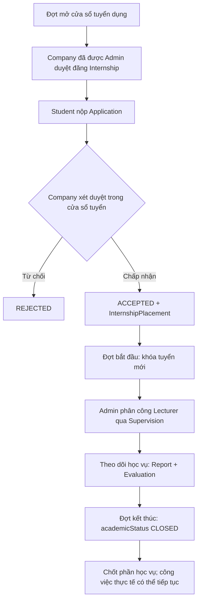

# InternHub — Yêu cầu nghiệp vụ

## 1. Mục tiêu

InternHub là hệ thống hỗ trợ nhà trường quản lý toàn bộ vòng đời thực tập: sinh viên tìm và ứng tuyển vị trí, doanh nghiệp tuyển chọn, nhà trường phân công giảng viên, sau đó các bên theo dõi và đánh giá quá trình thực tập.

Hệ thống phục vụ bốn nhóm người dùng:

| Vai trò    | Mục tiêu chính                                                                      |
| ---------- | ----------------------------------------------------------------------------------- |
| `STUDENT`  | Hoàn thiện hồ sơ, tìm vị trí, ứng tuyển, nộp báo cáo và xem kết quả.                |
| `COMPANY`  | Được duyệt hồ sơ doanh nghiệp, đăng vị trí, xét ứng viên và đánh giá thực tập sinh. |
| `LECTURER` | Theo dõi sinh viên được phân công, phản hồi báo cáo và đánh giá.                    |
| `ADMIN`    | Quản trị tài khoản, doanh nghiệp, kỳ thực tập, phân công và theo dõi hệ thống.      |

## 2. Phạm vi chức năng

| Phân hệ           | Nghiệp vụ                                                                                                                   |
| ----------------- | --------------------------------------------------------------------------------------------------------------------------- |
| Authentication    | Đăng ký và xác thực email, đăng nhập, refresh token, quên/đặt lại mật khẩu, đăng xuất và RBAC.                            |
| Hồ sơ             | Hồ sơ sinh viên, dự án cá nhân, kỹ năng, CV; hồ sơ giảng viên và doanh nghiệp.                                              |
| Đợt thực tập      | Quản lý cửa sổ tuyển dụng và khoảng theo dõi học vụ của từng đợt.                                                           |
| Vị trí thực tập   | Doanh nghiệp đăng vị trí theo kỳ, số lượng tuyển, hạn nộp và kỹ năng yêu cầu.                                               |
| AI gợi ý thực tập | Sinh viên lưu mong muốn công việc và chủ động tạo tối đa 10 gợi ý do backend xếp hạng; AI chỉ diễn giải tối đa 3 gợi ý đầu. |
| Ứng tuyển         | Sinh viên nộp đơn, doanh nghiệp xem xét và lưu lịch sử thay đổi trạng thái.                                                 |
| Placement         | Ghi nhận một đợt thực tập đã được xác nhận từ đơn được chấp nhận.                                                           |
| Hướng dẫn         | Admin phân công một giảng viên cho placement.                                                                               |
| Báo cáo           | Sinh viên nộp báo cáo tuần; giảng viên phản hồi, duyệt hoặc yêu cầu sửa.                                                    |
| Đánh giá          | Doanh nghiệp và giảng viên gửi hai đánh giá độc lập cho một placement.                                                      |
| Tệp tin           | Quản lý metadata tệp CV, báo cáo, chứng chỉ và giấy đăng ký doanh nghiệp; tệp lưu ở object storage.                         |
| Trao đổi          | Hội thoại giữa sinh viên và doanh nghiệp trong ngữ cảnh một đơn ứng tuyển.                                                  |
| Hệ thống          | Thông báo, dashboard, audit log.                                                                                            |

## 3. Vòng đời thực tập

`InternshipPlacement` là bản ghi trung tâm của giai đoạn thực tập thực tế. Mọi báo cáo, phân công và đánh giá đều phải gắn với placement, không chỉ gắn với sinh viên. `academicStatus` là vòng đời riêng cho phần trường theo dõi; khi đợt kết thúc, phần học vụ được đóng mà không ép công ty hoặc sinh viên kết thúc công việc thực tế.

## 4. Quy tắc nghiệp vụ

### 4.1. Xác thực và tài khoản

- Chỉ `STUDENT` và `COMPANY` có thể tự đăng ký. Email sinh viên phải dùng miền `@ut.edu.vn`.
- Tài khoản mới có trạng thái `PENDING_VERIFICATION`; token xác thực email có hiệu lực 24 giờ. Chỉ sau khi xác thực, tài khoản chuyển `ACTIVE` và mới có thể đăng nhập hoặc gọi API được bảo vệ.
- Luồng quên mật khẩu luôn trả phản hồi chung, không tiết lộ email có tồn tại hay không. Reset token có hiệu lực 30 phút, dùng một lần; đặt lại mật khẩu sẽ thu hồi mọi refresh token đang còn hiệu lực.
- Tài khoản `INACTIVE` hoặc `BANNED` không thể dùng access token, refresh token hoặc đăng nhập.

### 4.2. Doanh nghiệp và vị trí thực tập

- Tài khoản doanh nghiệp phải xác thực email trước. Hồ sơ doanh nghiệp mới bắt đầu ở `DRAFT`; doanh nghiệp phải bổ sung tên pháp lý, mã số doanh nghiệp, địa chỉ, người liên hệ, số điện thoại, email liên hệ và giấy đăng ký doanh nghiệp rồi gọi `POST /companies/me/submit-verification` để gửi xác minh.
- Chỉ hồ sơ `DRAFT` hoặc `REJECTED` được gửi; khi gửi thành công hồ sơ chuyển `PENDING` và xóa metadata của lần review trước. Trong `PENDING`, doanh nghiệp không được sửa hồ sơ; trong `SUSPENDED`, doanh nghiệp cũng không được sửa.
- Admin chỉ duyệt hoặc từ chối hồ sơ `PENDING`. Từ chối và đình chỉ bắt buộc có lý do tối thiểu 3 ký tự; mỗi quyết định lưu người thực hiện, thời điểm, audit log và gửi notification cho doanh nghiệp. Hồ sơ `APPROVED` mới có thể chuyển `SUSPENDED`.
- Sau khi duyệt, các trường nhận diện pháp lý—tên, mã số, địa chỉ, người liên hệ, điện thoại, email liên hệ và giấy đăng ký—bị khóa để tránh việc một hồ sơ đã được xác minh bị đổi danh tính mà không qua xét duyệt lại. Chỉ `APPROVED` mới được mở bài đăng; trạng thái tài khoản và trạng thái hồ sơ là hai lớp khác nhau.
- Internship luôn thuộc một `Semester` (tên kỹ thuật); trên nghiệp vụ/UI gọi là **Đợt thực tập**.
- Cửa sổ tuyển bắt đầu đúng một tháng dương lịch trước `startDate` và kết thúc khi đợt bắt đầu. Chỉ trong cửa sổ này được đăng/mở tin, nộp đơn hoặc chấp nhận ứng viên.
- Khi đợt bắt đầu, hệ thống đóng các tin `OPEN` còn lại. Không có tuyển mới trong khoảng theo dõi học vụ.
- Internship có các trạng thái `DRAFT`, `OPEN`, `CLOSED`, `CANCELLED`.
- Chỉ vị trí `OPEN`, chưa hết hạn và còn chỗ mới nhận đơn.
- `filledSlots` được tăng trong cùng transaction khi chấp nhận ứng viên.

### 4.3. Ứng tuyển và placement

- Một sinh viên chỉ có một application cho cùng một internship.
- Trạng thái application: `PENDING → REVIEWING → ACCEPTED | REJECTED`; sinh viên có thể chuyển đơn chưa kết thúc sang `WITHDRAWN`.
- Khi chấp nhận đơn, hệ thống tạo một `InternshipPlacement` duy nhất cho application đó và ghi `ApplicationStatusHistory`.
- Phải kiểm tra nghiệp vụ để một sinh viên không có nhiều placement `PENDING` hoặc `ACTIVE` trong cùng một đợt.
- Hủy placement không được xóa lịch sử application, report hay evaluation; chỉ thay đổi trạng thái sang `CANCELLED` khi phù hợp.
- `Internship.startDate/endDate` là lịch học vụ dự kiến do doanh nghiệp đề xuất. Phải nhập đủ cả hai và nằm trong khung theo dõi của đợt, hoặc để trống cả hai để Admin quyết định sau khi có placement.
- `InternshipPlacement.startDate/endDate` là khoảng trường chính thức theo dõi riêng cho sinh viên, không phải cam kết về toàn bộ thời gian làm thực tế tại doanh nghiệp. Admin phải đặt đủ hai ngày trong khung của đợt trước khi phân công giảng viên; lịch không được sửa sau khi theo dõi đã bắt đầu.

### 4.4. Phân công, báo cáo và đánh giá

- Một placement có tối đa một supervision đang hiệu lực; Admin là người tạo hoặc thay đổi phân công.
- Một placement có tối đa một báo cáo cho mỗi tuần (`week`). Tuần 1 được tính từ `placement.startDate`; sinh viên được nộp tuần hiện tại hoặc tuần đã qua nhưng không được nộp tuần tương lai hay ngoài khoảng placement.
- Báo cáo có trạng thái `DRAFT`, `SUBMITTED`, `APPROVED`, `REJECTED`.
- Mỗi placement có tối đa một evaluation loại `COMPANY` và một evaluation loại `LECTURER`.
- Chỉ tài khoản doanh nghiệp của placement hoặc giảng viên được phân công mới được tạo evaluation tương ứng. Quy tắc quyền này được kiểm tra ở service/guard.
- Chỉ tạo hoặc nộp report, tạo/sửa/xóa evaluation trong khoảng theo dõi riêng của placement và đồng thời phải nằm trong pha `MONITORING` của đợt. Khi `placement.endDate` hoặc đợt kết thúc, `academicStatus` chuyển `CLOSED`, supervision được hoàn tất; report đã `SUBMITTED` vẫn có thể được giảng viên duyệt để chốt kết quả.

### 4.5. Kỹ năng và đề xuất

- Danh mục kỹ năng được chuẩn hóa trong `skills`.
- Sinh viên khai báo kỹ năng kèm mức độ `BEGINNER`, `INTERMEDIATE`, `ADVANCED`, `EXPERT`.
- Doanh nghiệp gắn kỹ năng cho internship, đánh dấu bắt buộc hoặc ưu tiên và đặt trọng số.
- Điểm matching/recommendation là dữ liệu hỗ trợ, không thay thế quyết định tuyển dụng của doanh nghiệp.
- Sinh viên có thể lưu tối đa 5 role, location và work type mong muốn cho mỗi nhóm; các preference chỉ thuộc current student.
- Recommendation chỉ xét internship `OPEN`, chưa hết hạn, còn slot, company approved/active, đợt đang `RECRUITING`, chưa từng apply và không xung đột placement đang hiệu lực.
- Backend xếp hạng tối đa 10 candidate theo profile, skills, projects và preferences. AI chỉ được giải thích top 3 đã có rank; không tạo score, không đổi rank và không tự nộp đơn.
- Provider failure hoặc hồ sơ thiếu tín hiệu phải trả deterministic fallback thay vì làm hỏng kết quả.

### 4.6. Tệp và trao đổi

- Database chỉ lưu metadata và `storageKey`; không lưu URL công khai cố định. Giấy đăng ký doanh nghiệp dùng `FileType.COMPANY_REGISTRATION`, chỉ doanh nghiệp sở hữu và admin được tải qua signed URL.
- Ứng dụng tạo signed URL khi người có quyền cần tải tệp.
- Mỗi application có tối đa một `Conversation`; sau khi placement được tạo, placement cũng có tối đa một conversation riêng có thể bao gồm lecturer được phân công. Chỉ participant của conversation được gửi hoặc đọc message.

## 5. Yêu cầu phi chức năng

- API dùng JWT và RBAC, chỉ tài khoản `ACTIVE` được truy cập.
- Refresh token lưu hash, có hạn dùng và thời điểm thu hồi.
- Các thao tác nhạy cảm như duyệt doanh nghiệp, đổi trạng thái đơn, phân công và đánh giá phải tạo audit log.
- Dữ liệu PostgreSQL chạy trên Railway; chuỗi kết nối chỉ đặt trong `.env` hoặc biến môi trường, không commit vào Git.
- Realtime, Redis/distributed cache và CI/CD là hạng mục mở rộng. AI Job Recommendation phase đầu đã được triển khai với database cache và feature flag backend; không dùng AI matching trực tiếp từ frontend.

## 6. Phạm vi triển khai hiện tại

Tài liệu này là baseline nghiệp vụ. Repository hiện có các controller/service/UI cho nhiều phân hệ core; AI Job Recommendation và Company Verification là hai extension sau baseline, được ghi nhận tại `AI_JOB_RECOMMENDATION_PLAN.md` và `COMPANY_VERIFICATION_PLAN.md`. API thực tế dùng prefix `/api/v1` và wrapper success chuẩn.
