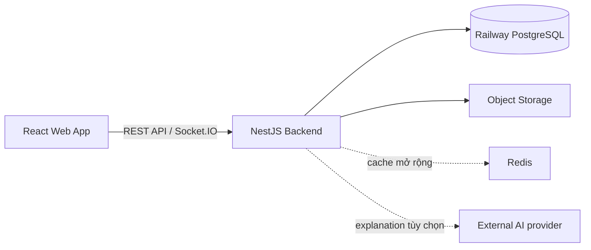
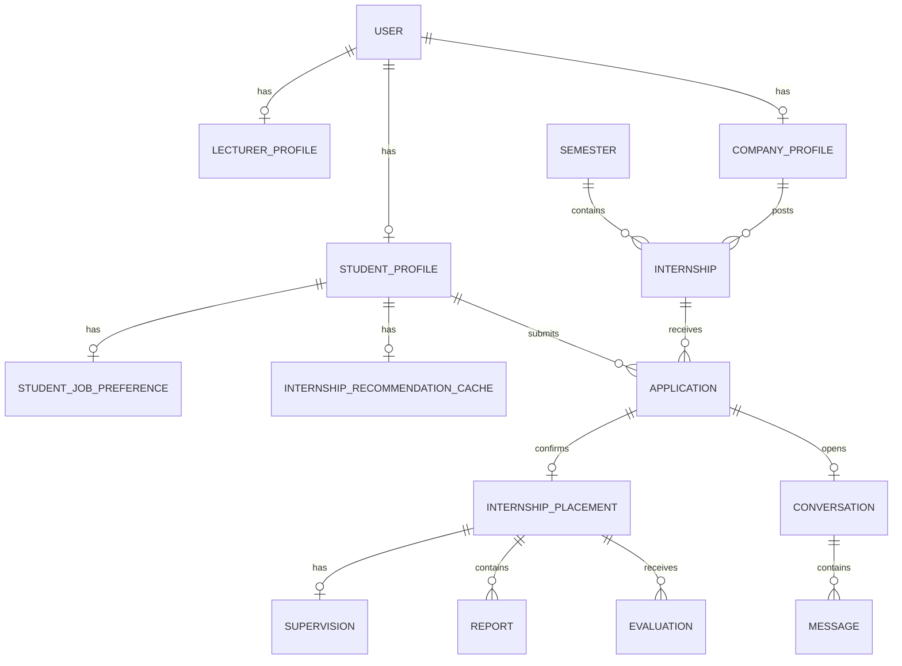

# InternHub — Thiết kế hệ thống

Tài liệu này mô tả cấu trúc backend và database **đang có trong repository**. Các phần ghi “roadmap” là định hướng lịch sử; Recommendation API, preferences, cache và UI Internship đã được triển khai sau baseline.

## 1. Kiến trúc tổng quan



| Thành phần | Trách nhiệm |
|---|---|
| React | Giao diện cho bốn role; gọi REST API và nhận realtime events. |
| NestJS | Authentication, RBAC, nghiệp vụ, transaction và phát hành signed URL. |
| Prisma | Schema, generated client và migration PostgreSQL. |
| Railway PostgreSQL | Nguồn dữ liệu chính của dự án. |
| Object Storage | Lưu nội dung tệp; database chỉ lưu metadata. |
| External AI provider | Chỉ tạo diễn giải cho top 3 recommendation đã được backend xếp hạng; không quyết định điểm hoặc thứ hạng. |
| Redis / Socket.IO | Hạng mục mở rộng cho cache, rate limit theo distributed store và realtime. |

## 2. Cấu trúc backend

```text
Backend/
├── prisma/
│   └── schema.prisma              # Nguồn chuẩn của database model
├── src/
│   ├── auth/                      # JWT, refresh token, Passport strategy
│   ├── users/                     # Quản trị user/role
│   ├── students/                  # Hồ sơ, dự án, CV, kỹ năng
│   ├── lecturers/                 # Hồ sơ giảng viên
│   ├── companies/                 # Doanh nghiệp và phê duyệt
│   ├── semesters/                 # Đợt thực tập và lifecycle theo thời gian
│   ├── skills/                    # Danh mục và matching metadata
│   ├── recommendations/            # Ranking, cache và AI explanation có kiểm soát
│   ├── internships/               # Bài đăng thực tập
│   ├── applications/              # Đơn ứng tuyển và state machine
│   ├── placements/                # Đợt thực tập đã xác nhận
│   ├── supervisions/              # Phân công giảng viên theo placement
│   ├── reports/                   # Báo cáo tuần và review
│   ├── evaluations/               # Đánh giá độc lập từ company/lecturer
│   ├── files/                     # Metadata và policy truy cập file
│   ├── chat/                      # Conversation và message
│   ├── notifications/             # Thông báo trong hệ thống
│   ├── dashboard/                 # Query tổng hợp, chỉ đọc
│   ├── audit-logs/                # Audit trail
│   ├── common/                    # Decorator, guard, filter, interceptor
│   ├── prisma/                    # PrismaService
│   ├── generated/prisma/          # Sinh tự động; không commit
│   ├── app.module.ts              # Đăng ký các module
│   └── main.ts                    # Bootstrap, CORS, Helmet, validation
├── .env.example
└── package.json
```

Tên module dùng số nhiều nhất quán, gồm `supervisions` (không dùng `supervision`). Chỉ `src/supervisions/supervisions.module.ts` được đăng ký bởi `AppModule`.

## 3. Domain model và quan hệ



`InternshipPlacement` là bản ghi xác nhận sinh viên thực tập tại một internship trong một đợt thực tập. Đây là “aggregate” dùng cho theo dõi sau tuyển dụng; không dùng `student_id` đơn lẻ cho report, supervision hoặc evaluation. `academicStatus` tách phần trường theo dõi khỏi trạng thái làm việc thực tế tại công ty.

## 4. Thiết kế database

Schema nguồn: `Backend/prisma/schema.prisma`. Prisma Client được generate vào `src/generated/prisma` bởi `postinstall` hoặc `npm run build`.

### 4.1. Nhóm identity và profile

| Model | Trường / ràng buộc quan trọng | Mục đích |
|---|---|---|
| `User` | `email` unique, `role`, `status` | Tài khoản gốc cho bốn role. |
| `RefreshToken` | `tokenHash` unique, `expiresAt`, `revokedAt` | Phiên đăng nhập có thể thu hồi. |
| `StudentProfile` | `userId` unique, `studentCode` unique, `cvFileId` | Hồ sơ sinh viên. |
| `StudentProject` | `studentId`, repo/demo URL | Dự án cá nhân của sinh viên. |
| `StudentJobPreference` | `studentId` unique, role/location/work-type arrays | Mong muốn công việc của sinh viên. |
| `InternshipRecommendationCache` | `studentId` unique, fingerprint, result JSON, expiry | Cache recommendation theo dữ liệu profile và candidate. |
| `LecturerProfile` | `userId` unique, `department` | Hồ sơ giảng viên. |
| `CompanyProfile` | `status`, `reviewedById`, `rejectionReason` | Hồ sơ và lịch sử xét duyệt doanh nghiệp. |

### 4.2. Nhóm kỳ, vị trí và kỹ năng

| Model | Trường / ràng buộc quan trọng | Mục đích |
|---|---|---|
| `Semester` | `name` unique, `startDate`, `endDate`, `status` | Đợt thực tập; cửa sổ tuyển được suy ra là một tháng trước `startDate`. |
| `Internship` | `companyId`, `semesterId`, `slots`, `filledSlots`, `deadline`, `status` | Vị trí doanh nghiệp tuyển trong một kỳ. |
| `Skill` | `name` unique | Danh mục kỹ năng chuẩn. |
| `StudentSkill` | PK `(studentId, skillId)`, `level` | Kỹ năng và mức độ của sinh viên. |
| `InternshipSkill` | PK `(internshipId, skillId)`, `isRequired`, `weight` | Yêu cầu kỹ năng của vị trí. |

### 4.3. Nhóm workflow thực tập

| Model | Trường / ràng buộc quan trọng | Mục đích |
|---|---|---|
| `Application` | unique `(studentId, internshipId)`, `status`, `cvFileId` | Đơn ứng tuyển. |
| `ApplicationStatusHistory` | `fromStatus`, `toStatus`, `changedById` | Lịch sử thay đổi trạng thái đơn. |
| `InternshipPlacement` | `applicationId` unique, student/company/internship/semester, `academicStatus`, `academicClosedAt` | Placement thực tế và trạng thái phần học vụ. |
| `Supervision` | `placementId` unique, `lecturerId`, `assignedById` | Một giảng viên hướng dẫn placement. |
| `Report` | unique `(placementId, week)`, `fileId`, `status` | Báo cáo tuần. |
| `Evaluation` | unique `(placementId, type)`, `evaluatorId`, `score` | Một đánh giá company và một đánh giá lecturer. |

### 4.4. Nhóm hỗ trợ hệ thống

| Model | Trường / ràng buộc quan trọng | Mục đích |
|---|---|---|
| `File` | `storageKey` unique, `originalName`, `mimeType`, `sizeBytes` | Metadata cho tệp private. |
| `Conversation` | `applicationId` unique, `studentId`, `companyId` | Hội thoại có ngữ cảnh đơn ứng tuyển. |
| `Message` | `conversationId`, `senderId`, `readAt` | Tin nhắn trong conversation. |
| `Notification` | `userId`, `isRead`, `readAt` | Thông báo cho người dùng. |
| `AuditLog` | `userId`, `action`, `entity`, `entityId`, `metadata` | Truy vết hoạt động. |

### 4.5. Enum chính

| Enum | Giá trị |
|---|---|
| `Role` | `ADMIN`, `STUDENT`, `LECTURER`, `COMPANY` |
| `ApplicationStatus` | `PENDING`, `REVIEWING`, `ACCEPTED`, `REJECTED`, `WITHDRAWN` |
| `PlacementStatus` | `PENDING`, `ACTIVE`, `COMPLETED`, `CANCELLED` |
| `AcademicMonitoringStatus` | `PENDING`, `ACTIVE`, `CLOSED`, `CANCELLED` |
| `ReportStatus` | `DRAFT`, `SUBMITTED`, `APPROVED`, `REJECTED` |
| `EvaluationType` | `COMPANY`, `LECTURER` |
| `CompanyStatus` | `PENDING`, `APPROVED`, `REJECTED` |

## 5. Transaction và phân quyền cần triển khai

Các ràng buộc unique trong schema xử lý tính nhất quán cơ bản. Các quy tắc dưới đây phải nằm trong service và chạy transaction khi có nhiều thao tác ghi:

1. Khi company chấp nhận application: kiểm tra internship còn chỗ, chuyển status, tạo status history, tạo placement, tạo conversation nếu chưa có, rồi tăng `filledSlots`.
2. Một đợt có ba pha tự tính theo thời gian: `UPCOMING`, `RECRUITING` (một tháng trước ngày bắt đầu), `MONITORING` (từ ngày bắt đầu đến hết ngày kết thúc), sau đó `COMPLETED`. Chỉ pha `RECRUITING` được đăng tin, ứng tuyển và chấp nhận.
3. Khi đợt chuyển sang `MONITORING`, các tin `OPEN` còn lại được đóng. Khi đợt kết thúc, `academicStatus` được đóng nhưng không tự kết thúc placement thực tế.
4. Khi tạo report/evaluation, kiểm tra người gọi là chủ placement hoặc người được phân công phù hợp, đồng thời đang trong pha theo dõi học vụ.
5. Khi cấp signed URL, kiểm tra quyền trên entity tham chiếu tới file trước khi trả URL.
6. Mọi thao tác quản trị và state transition ghi `AuditLog`.

## 6. API map và roadmap

Các endpoint dưới đây là API map cấp cao. Contract chi tiết của AI Job Recommendation đã ổn định tại `AI_JOB_RECOMMENDATION_PLAN.md`; các endpoint khác cần đối chiếu controller hiện tại khi thay đổi.

| Module | Endpoint dự kiến |
|---|---|
| Auth | `POST /api/v1/auth/register`, `/login`, `/refresh`, `/logout` |
| Internships | `GET /api/v1/internships`, `POST /api/v1/internships`, `PATCH /api/v1/internships/:id` |
| Applications | `POST /api/v1/applications`, `PATCH /api/v1/applications/:id/status` |
| Placements | `GET /api/v1/placements/me`, `PATCH /api/v1/placements/:id/status` |
| Supervisions | `POST /api/v1/supervisions`, `GET /api/v1/supervisions/me` |
| Reports | `POST /api/v1/reports`, `PATCH /api/v1/reports/:id/review` |
| Evaluations | `POST /api/v1/placements/:placementId/evaluations` |
| Files | `POST /api/v1/files/upload-url`, `GET /api/v1/files/:id/download-url` |
| Chat | `GET /api/v1/conversations`, `POST /api/v1/conversations/:id/messages` |
| Recommendations | `GET /api/v1/recommendations/internships/me`, `POST /api/v1/recommendations/internships/me/generate` |

## 7. Railway PostgreSQL và migration

Railway chỉ cung cấp PostgreSQL; backend/Prisma chạy từ máy local trong giai đoạn hiện tại.

1. Tạo PostgreSQL service trên Railway.
2. Copy `DATABASE_PUBLIC_URL` (hoặc URL TCP Proxy) vào `Backend/.env` dưới tên `DATABASE_URL`.
3. Chạy `npm install` tại thư mục `Backend`.
4. Khi database còn trống, tạo migration đầu tiên: `npm exec prisma migrate dev -- --name init`.
5. Commit thư mục `prisma/migrations`; không commit `.env` hay `src/generated/prisma`.

Sau khi migration đã tồn tại, môi trường dùng chung chỉ nên áp dụng migration bằng `npm exec prisma migrate deploy`.

## 8. Kiểm tra nền dự án

```bash
cd Backend
npm run build
npm test -- --runInBand
```
